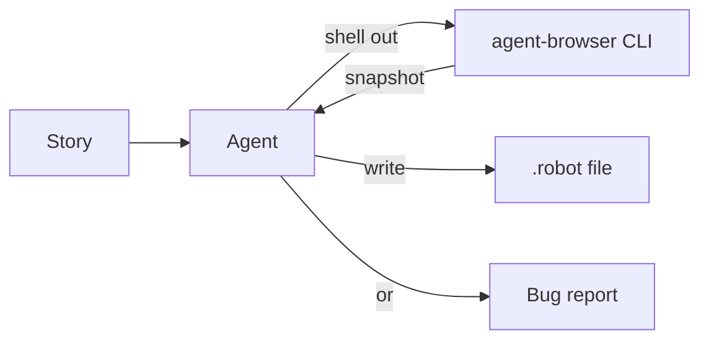

# Authoring Agent

The authoring agent is the LLM-in-the-loop component that produces `.robot` files from plain-English stories. It runs once per suite, during development — not at test time.

## Agent architecture



The agent is built on DeepAgents (a LangGraph wrapper) with two tools:

1. **`execute`** — runs bash commands (primarily `agent-browser` subcommands)
2. **`write_robot_suite`** — writes the final `.robot` file

## How authoring works

### Phase 1: Orient

The agent verifies its environment: Robot Framework importable, `agent-browser` on PATH, LLM endpoint configured. If anything is missing, it reports immediately rather than failing mid-exploration.

### Phase 2: Explore

The agent drives the live target via `agent-browser` commands:

```bash
# Navigate and take an accessibility snapshot
agent-browser open http://localhost:5173 && agent-browser snapshot -c -i --json

# Probe specific elements
agent-browser get count '[data-testid="case-row"]' --json
agent-browser get text '.sidebar h2' --json
```

Key principle: **selectors come from live snapshots, never invented.** If the agent can't find an element in the snapshot, it doesn't guess a selector — it explores further or reports a bug.

### Phase 3: Author

Using the observed selectors, the agent composes a `.robot` file following the keyword grammar in `SKILL.md`:

```robot
*** Settings ***
Library    aitester_bdd.AITester

*** Variables ***
${ENGINE}    agent-browser

*** Test Cases ***
Login Flow
    [Setup]    Given I start scenario "login" at "http://localhost:5173/login"
    I define rule "fill_credentials"
        When I type "admin" into "#username"
        And I type "secret" into "#password"
        When I click locator "#submit"
        Then url contains "/dashboard"
    [Teardown]    Then I finalize verification
```

### Phase 4: Review

The agent dry-runs the suite: `robot --dryrun suite.robot`. If keywords don't parse, it fixes the suite and re-tries.

### Phase 5: Refine (on failure)

If a real run fails, the agent re-explores the failing step, checks whether the selector changed, and patches the suite.

## The bug report exit

When the system is broken in a way that prevents authoring:

- Login form doesn't exist
- Required page is a 500 error
- Auth flow loops infinitely
- UI element is permanently hidden

The agent writes `triage/<story-slug>.md` instead of inventing a suite that would always fail. This is an explicit exit channel — no "best effort" suites.

## SKILL.md as grammar

The `SKILL.md` file (1069 lines) shipped inside the wheel is the agent's system prompt. It defines:

- Every available keyword (Given/When/Then) with argument shapes
- The rule DAG composition rules
- What the agent is and isn't allowed to do
- Patterns for common flows (auth, observations, scoping)
- The `agent-browser` CLI surface

Without this skill loaded, the LLM would emit prose or generic pytest code. With it, the LLM emits valid aitester-bdd `.robot` files.

## Explore rules (fluid testing)

The `I explore` keyword creates a rule that's walked by the agent at run time:

```robot
When I explore "Navigate to settings, toggle dark mode, verify the theme changes"
```

Unlike authored rules (which are deterministic), explore rules invoke the agent loop at execution time. They participate in topo-sort like pinned rules.

With the Playwright backend (default), the explore agent uses **typed Python tools** (`browser_click`, `browser_get_text`, `browser_snapshot`, etc.) that call the same RF Browser instance the walker uses. No subprocess, no session handoff — the agent operates on the same page, cookies, and DOM state as the pinned rules before it. Mixed suites (pinned login → fluid explore) work seamlessly.

With the agent-browser backend, the explore agent falls back to shelling out to the `agent-browser` CLI with a shared session ID.

Use cases:

- Resilient tests that survive UI refactors (the agent adapts to the current DOM)
- Exploratory testing in CI
- Mixed suites: pinned rules for fast deterministic setup, fluid explore for resilient verification
- One-off verification that doesn't need a committed suite

Trade-off: ~$1-3 per explore rule execution (LLM tokens).
