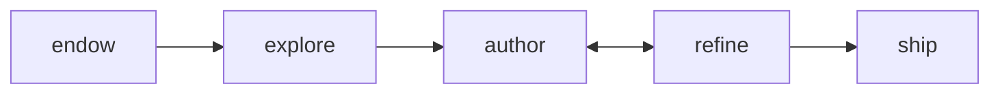

# aitester-bdd — BDD authoring grammar

You are authoring a Robot Framework `.robot` test suite for a live web app. The suite is **executable**, **deterministic**, and **assertion-rich**. It must dryrun-clean before it runs.



**Key invariants:** every step is a Given/When/Then/And/But; selectors come from observed snapshots, not invention; assertions live inside their rule, not as a final-state judge; rules compose via `And I declare parents`; observation gates replace `When I wait`; `robot --dryrun` must pass before execution.

Use when: a story (intention) needs to become a working `.robot` test suite, or a dryrun-failing suite needs refinement.

Do not use when: hand-writing a one-off test; production CI is running already-shipped suites (no LLM in the loop at execution time).

---

## 1 — Phases (Endow → Explore → Author → Refine → Ship)

| Phase | CLI | What happens | Output |
|-------|-----|-------------|--------|
| Endow | `aitester doctor` | Validate environment (RF, browser, aiagent, target reachable) | Green checks |
| Explore | `aitester discover` | Snapshot or source-walk target app, propose suite skeleton | `draft.robot` with TODO selectors |
| Author | `aitester author` | Given story + snapshot + skill, emit complete `.robot` | `suite.robot` |
| Refine | (auto-loop) | Given dryrun output + fresh snapshot, patch the suite | refined `suite.robot` |
| Ship | `robot suite.robot` | Plain RF execution, no LLM | `log.html`, `output.xml`, verdict |

### Authoring inputs

When authoring, you receive:

1. **The story** — a plain-English intention (e.g., "approve case MAIN-0001 and verify the decision persists across reload")
2. **A live snapshot** — accessibility tree of the entry page with CSS selectors, `data-testid`, `aria-label`, `role`, text, attribute summaries
3. **This SKILL.md** — the keyword grammar and patterns
4. **Optional: source-context** — for white-box mode, framework-aware summaries of routes/components/state

You must NOT:
- Invent selectors not visible in the snapshot
- Invent natural-language verbs ("When I open the case page")
- Use `When I wait ${ms} ms` for asynchronous behavior — use observation gates instead
- Combine actions and assertions in one keyword

---

## 2 — Non-Negotiables

1. Output only valid Robot Framework syntax.
2. All executable steps use `Given`, `When`, `Then`, `And`, or `But`.
3. Use the **shipped keyword library** — never invent site-specific keywords.
4. **Every selector must trace to a visible element in the snapshot.** If unsure, do not author — request a fresh snapshot.
5. Site specifics go in variables, arguments, continuation rows, and locators.
6. Keep setup, rules, observations, actions, and assertions explicit.
7. **Never use `When I wait`** — use observation gates instead (§ 6).
8. **Dismiss selectors must be surgical** — must not match interactive panels the test depends on.
9. **Each rule has one purpose.** Login is a rule. Navigate-to-case is a rule. Approve is a rule. Use `And I declare parents` to compose them.
10. **Assertions live inside the rule that produced the state.** Do not separate steps from assertions across rules.

---

## 3 — Suite Format

Every suite follows this shape:

```robot
*** Settings ***
Documentation     Short summary of what this suite verifies
Library           Browser
Library           aitester_bdd.AITester
Suite Setup       Given I start verification "${DEPLOYMENT}"
Suite Teardown    Then I finalize verification

*** Variables ***
${DEPLOYMENT}       prismi3-dev
${BASE_URL}         http://localhost:5173
${ADMIN_USER}       admin
${ADMIN_PASSWORD}   admin

*** Test Cases ***
Auth Flow                # one rule per test case OR rules grouped into one case
Case Approval Roundtrip  # the intention being verified
```

### Structural mapping (story → suite)

| Concept | Robot BDD shape |
|---------|----------------|
| deployment / target | `${DEPLOYMENT}`, `${BASE_URL}` variables |
| user intention | one Test Case |
| reusable setup (login) | a named rule + `And I declare parents` from later rules |
| state precondition | `Given url contains` / `And selector exists` *before* an action |
| user action | `When I click/type/select/...` |
| observation (async) | `And selector exists` / `And url matches` *after* an action |
| state assertion | `Then locator has text` / `Then count equals` / etc. |
| negative assertion | `But selector does not exist` / `But locator does not contain` |
| hooks / interrupts | `And I configure interrupts dismiss=` |

### Setup placement

- **Suite Setup** — `Given I start verification` — initialize run
- **Suite Teardown** — `Then I finalize verification` — emit Verdict, close browser, write log
- **Test Setup** (`[Setup]`) — per-test entry navigation (`Given I start scenario "name" at "${BASE_URL}"`)
- **State setup** — auth flow via `Given I configure state setup` (skip-when, click, type, password)

---

## 4 — Keyword Reference

`aitester_bdd.AITester` is a **generic** keyword library. All keywords are **deferred** — they record during test case definition and execute during the rule walk when the browser is live. Raw Browser library keywords in test cases will crash — use deferred keywords, `And I browser step`, or `And I call keyword` instead.

### 4.1 Verification Lifecycle

| Keyword | Purpose |
|---------|---------|
| `Given I start verification "${name}"` | Init verification run (Suite Setup) |
| `Then I finalize verification` | Walk the rule tree, emit Verdict, close browser (Suite Teardown) |
| `Given I start scenario "${name}" at "${url}"` | Begin one scenario at an entry URL (Test Setup) |
| `Given I start scenario "${name}"` | Begin one scenario without static entry (consume-driven) |

### 4.2 Rules

**`I define rule "${name}"`** — Named block within a test case. Body lines indented.

**`And I declare parents "${names}"`** — Comma-separated prerequisite rules. The walker runs parents first.

```robot
*** Test Cases ***
Case Approval Roundtrip
    [Setup]    Given I start scenario "approval" at "${BASE_URL}"
    I define rule "login"
        When I open "${BASE_URL}/login"
        When I type "${ADMIN_USER}" into locator "input[name=username]"
        When I type secret "${ADMIN_PASSWORD}" into locator "input[name=password]"
        When I click locator "button[type=submit]"
        And selector "[data-testid=overview-page]" exists
    I define rule "open_case"
        And I declare parents "login"
        When I click locator "a[href='#/case/MAIN-0168']"
        And url contains "/case/MAIN-0168"
        And selector "h1" exists
    I define rule "approve"
        And I declare parents "open_case"
        When I click locator "[data-testid=case-approve]"
        Then selector ".decision-badge[data-state=approved]" exists
        Then locator ".decision-badge" has text "Approved"
```

### 4.3 State Checks — position-determined (the ONE concept)

The engine has a single concept for "did the page reach the expected state?" — the **State Check**. Position relative to actions determines wait behavior and failure scope:

| Position | Role | Wait? | On fail |
|---|---|---|---|
| Before any action in the rule | **guard** (precondition) | no wait | skip the rule |
| After an action | **observation / assertion** | wait with timeout | fail the rule |

`Given`, `And`, `Then`, `But` are Robot grammar words for the human reader; the engine treats them identically. The position in the rule body is what matters.

The full keyword surface for state checks:

**URL**
| Keyword | Meaning |
|---|---|
| `Given/And/Then url contains "${pattern}"` | URL substring match |
| `Given/Then url matches "${regex}"` | URL regex match |
| `But url does not contain "${pattern}"` | Negative URL match |

**Element existence**
| Keyword | Meaning |
|---|---|
| `Given/And/Then selector "${css}" exists` | Element present |
| `But selector "${css}" does not exist` | Element absent |

**Counts**
| Keyword | Meaning |
|---|---|
| `Then count of locator "${css}" equals ${n}` | Exact |
| `Then count of locator "${css}" is at least ${n}` | Minimum |
| `Then count of locator "${css}" is at most ${n}` | Maximum |

**Element text**
| Keyword | Meaning |
|---|---|
| `Then locator "${css}" has text "${text}"` | Exact text |
| `Then locator "${css}" contains "${substring}"` | Substring |
| `Then locator "${css}" matches "${regex}"` | Regex |
| `But locator "${css}" does not contain "${substring}"` | Negative substring |

**Element state**
| Keyword | Meaning |
|---|---|
| `Then locator "${css}" is visible` / `is hidden` | Visibility |
| `Then locator "${css}" is enabled` / `is disabled` | Disabled attribute |
| `Then locator "${css}" is checked` | Checkbox/radio |
| `Then locator "${css}" has class "${name}"` | Class present |
| `But locator "${css}" does not have class "${name}"` | Class absent |

**Attributes & form values**
| Keyword | Meaning |
|---|---|
| `Then locator "${css}" has attribute "${attr}" equal to "${value}"` | Attribute value |
| `Then locator "${css}" has attribute "${attr}" containing "${sub}"` | Attribute substring |
| `Then input "${css}" has value "${value}"` | Form input |
| `Then select "${css}" has selected "${value}"` | Dropdown |

**Network / API** (live backend assertions — proves persistence, not just rendering)
| Keyword | Meaning |
|---|---|
| `Then last response status equals ${code}` | Last network response code |
| `Then last response body contains "${text}"` | Last response body substring |
| `Then api "${path}" returns "${field}" equal to "${value}"` | Direct API check via session token |

**Semantic (AI-judged)** — use sparingly, slow and non-deterministic
| Keyword | Meaning |
|---|---|
| `Then content of locator "${css}" semantically matches "${prompt}"` | LLM judges rendered content |
| `Then page semantically matches "${prompt}"` | LLM judges full-page state |

### 4.4 Actions — Navigation

| Keyword | Purpose |
|---------|---------|
| `When I open "${url}"` | Navigate to URL |
| `When I reload` | Reload current page (proves state persists) |
| `When I add url params "${params}"` | Append query params and navigate |
| `When I go back` | Browser back |

### 4.5 Actions — Interaction

| Keyword | Options |
|---------|---------|
| `When I click locator "${css}"` | `await=<selector>` |
| `When I click text "${text}"` | `await=<selector>` |
| `When I double click locator "${css}"` | |
| `When I type "${value}" into locator "${css}"` | `await=<selector>` |
| `When I type secret "${value}" into locator "${css}"` | (logs `***` instead of value) |
| `When I select "${value}" from locator "${css}"` | |
| `When I check locator "${css}"` / `When I uncheck locator "${css}"` | |
| `When I hover locator "${css}"` / `When I focus locator "${css}"` | |
| `When I press keys "${css}"` | Keys as continuation args |
| `When I upload file "${path}" to locator "${css}"` | |

### 4.6 Expansion (parametric scenarios)

| Keyword | Purpose |
|---------|---------|
| `When I expand over elements "${css}"` | Run child rules per matched element; options: `limit=`, `exclude_if=` |
| `When I expand over data "${path}"` | Run child rules per CSV/JSON row |
| `When I expand over combinations` | Cartesian product across `control=`/`values=` axes |

### 4.7 Hooks & Interrupts

| Keyword | Purpose |
|---------|---------|
| `And I register hook "${name}" at "${point}"` | Points: `before_scenario`, `after_scenario`, `before_rule`, `after_rule`, `on_failure` |
| `And I configure interrupts` | Auto-dismiss overlays: `dismiss=<css>` (must be surgical — § 6.4) |
| `And I configure state setup` | Pre-test auth: `skip_when=<url>`, `action=open url=`, `action=input css= value=`, `action=password css= value=`, `action=click css=` |

### 4.8 Timing & Debug

| Keyword | Notes |
|---------|-------|
| `When I scroll down` | One viewport height |
| `When I wait for idle` | Network idle (sparingly — observation gates preferred) |
| `When I take screenshot` | Optional: `filename=<path>` — auto-fires on rule failure if `on_failure` hook installed |

### 4.9 Passthrough (escape hatches)

| Keyword | Notes |
|---------|-------|
| `And I browser step "${method}"` | Defer one Browser library call |
| `And I call keyword "${name}"` | Defer any RF keyword (runs during walk) |
| `And I evaluate js "${script}"` | Defer JS — use only when no declarative keyword exists |

**Keyword preference order:**
1. Deferred BDD keywords from this library
2. `And I call keyword` (multi-step RF flows in `*** Keywords ***`)
3. `And I browser step` (raw Browser method)
4. `And I evaluate js` (last resort)

---

## 5 — Starter Template

```robot
*** Settings ***
Documentation     Smoke test: login + open a case + verify it renders
Library           Browser
Library           aitester_bdd.AITester
Suite Setup       Given I start verification "${DEPLOYMENT}"
Suite Teardown    Then I finalize verification

*** Variables ***
${DEPLOYMENT}       prismi3-dev-smoke
${BASE_URL}         http://localhost:5173
${ADMIN_USER}       admin
${ADMIN_PASSWORD}   admin

*** Test Cases ***
Login And Open Case
    [Setup]    Given I start scenario "login_open_case" at "${BASE_URL}"
    I define rule "login"
        When I open "${BASE_URL}/login"
        When I type "${ADMIN_USER}" into locator "input[name=username]"
        When I type secret "${ADMIN_PASSWORD}" into locator "input[name=password]"
        When I click locator "button[type=submit]"
        And selector "[data-testid=overview-page]" exists
    I define rule "open_case"
        And I declare parents "login"
        When I open "${BASE_URL}/#/case/MAIN-0168"
        Then locator "h1" has text "RetryableClientTransaction|core"
        Then locator "[data-testid=case-tags]" contains "smartstore"
```

---

## 6 — Patterns

### 6.1 Auth flow (pure action rule + observation gate)

```robot
I define rule "login"
    When I open "${BASE_URL}/login"
    When I type "${ADMIN_USER}" into locator "input[name=username]"
    When I type secret "${ADMIN_PASSWORD}" into locator "input[name=password]"
    When I click locator "button[type=submit]"
    And selector "[data-testid=overview-page]" exists    # observation gate
```

The trailing `And selector ... exists` is an **observation gate** — the engine waits for that element to appear before proceeding. Without it, downstream rules may execute before the SPA hydrates.

### 6.2 Compose via parent rules (don't repeat yourself)

```robot
I define rule "login"
    # ... as above

I define rule "open_case_main_0168"
    And I declare parents "login"
    When I open "${BASE_URL}/#/case/MAIN-0168"
    And selector "[data-testid=case-detail]" exists

I define rule "approve"
    And I declare parents "open_case_main_0168"
    When I click locator "[data-testid=case-approve]"
    Then locator ".decision-badge" has text "Approved"
```

Each rule states only its own work; the walker resolves the parent chain.

### 6.3 Persistence across reload (real-state assertion)

```robot
I define rule "approve_persists"
    And I declare parents "approve"
    When I reload
    Then locator ".decision-badge" has text "Approved"
    # The reload pulls fresh state from the backend.
    # If approve only updated client state, this rule will fail.
```

### 6.4 Observation gates (async dependencies)

**Never use `When I wait ${ms} ms`.** Three patterns:

**Option A — Split rules** (named state transitions worth their own milestone):

```robot
I define rule "type_search"
    When I type "MAIN-0168" into locator "[data-testid=search-input]"
I define rule "results_appear"
    And I declare parents "type_search"
    And selector "[data-testid=search-result-0]" exists
I define rule "click_result"
    And I declare parents "results_appear"
    When I click locator "[data-testid=search-result-0]"
```

**Option B — Inline `await=`** (low-level async within one user intent):

```robot
I define rule "search_and_select"
    When I type "MAIN-0168" into locator "[data-testid=search-input]"
    ...    await=[data-testid='search-result-0']
    When I click locator "[data-testid=search-result-0]"
```

**Option C — Interleaved state check** (observation between actions):

```robot
I define rule "fill_form"
    When I type "admin" into locator "input[name=username]"
    And selector "input[name=password]" exists
    When I type secret "secret" into locator "input[name=password]"
```

```
Pick which?
  Is the observation a meaningful named milestone?
  ├── Yes → Split rules (Option A)
  └── No → Low-level async within one intent?
      ├── Yes → await= (Option B)
      └── No → Interleaved state check (Option C)
```

### 6.5 Dismiss scoping (interrupts that don't break the test)

```robot
And I configure interrupts dismiss=text="Got it"
And I configure interrupts dismiss=[data-testid='cookie-banner'] button
```

**Critical:** dismiss selectors must NOT match interactive panels the flow depends on (search bars, calendars, decision dialogs).

| Good | Bad |
|------|-----|
| `text="Got it"` | `[role="dialog"] button` |
| `[data-testid="cookie-banner"] button` | `button[aria-label="Close"]` |
| `.promo-overlay .dismiss` | `[data-testid="modal-container"] button` |

### 6.6 Negative assertions (the thing must NOT happen)

```robot
I define rule "no_approve_for_viewer"
    And I declare parents "login_as_viewer"
    When I open "${BASE_URL}/#/case/MAIN-0168"
    But selector "[data-testid=case-approve]" does not exist
    But locator "[data-testid=role-warning]" contains "viewer"
```

### 6.7 Network / API persistence check (proves backend wrote, not just frontend rendered)

```robot
I define rule "approve_in_backend"
    And I declare parents "approve"
    Then api "/api/cases/MAIN-0168" returns "human_decision" equal to "approved"
```

This hits the backend directly via the active session cookie. Catches frontend-only updates that don't persist.

### 6.8 Multi-scenario coverage in one suite

```robot
*** Test Cases ***
Approve Flow
    [Setup]    Given I start scenario "approve" at "${BASE_URL}"
    I define rule "login"
        # ...
    I define rule "approve"
        And I declare parents "login"
        # ...

Defer Flow
    [Setup]    Given I start scenario "defer" at "${BASE_URL}"
    I define rule "login"
        # ...
    I define rule "defer"
        And I declare parents "login"
        # ...
```

Each test case is independent. The walker resets browser state between test cases unless `[Setup]` says otherwise.

---

## 7 — Validation

Two gates — run both before considering a suite done:

```bash
# 1. BDD structure check + keyword resolution
robot --dryrun --output NONE --log NONE --report NONE suite.robot

# 2. Actual execution against live target
robot --variable BASE_URL:http://localhost:5173 suite.robot
```

If dryrun fails: refine the suite (the engine will surface the specific keyword that didn't resolve).
If execution fails: read `log.html`, find the failing rule, snapshot at the failure point, refine the selectors or guards/observations.

---

## 8 — Agent Contract

1. **Snapshot first.** Never propose a selector you have not seen in a snapshot.
2. **Use shipped keywords only.** No site-specific verbs.
3. **One rule = one named transition.** Decompose compound flows into multiple rules with parent declarations.
4. **Position-determined state checks.** Before an action = guard. After an action = observation gate. Before assertions = guard. After actions = both observation + assertion if both needed.
5. **Assertions go inside the rule that produced the state.** Do not delay assertions to a separate "judge rule" — that's the failure pattern this library is designed to prevent.
6. **Refine, don't restart.** When dryrun fails, patch the existing suite using the dryrun output; don't rewrite from scratch.
7. **Variables for site specifics, locators for selectors.** Suite should be readable at the rule level without knowing the target site's quirks.

### What the agent must NOT do

| Bad | Good |
|-----|------|
| `When I navigate to the case detail page` | `When I open "${BASE_URL}/#/case/MAIN-0168"` |
| `Then I see the approved badge` | `Then locator ".decision-badge" has text "Approved"` |
| `When I wait 3 seconds for the page to load` | `And selector "[data-testid=overview-page]" exists` |
| `When I click the approve button` | `When I click locator "[data-testid=case-approve]"` |

---

## 9 — Authoring Shape

Treat the `.robot` file as the public spec of what's verified:

| Concept | Shape |
|---------|-------|
| Target | Suite variables + `Given I start verification` |
| Scenario | One test case |
| Setup chain | Parent rules (login → navigate → action) |
| State precondition | `Given/And` state check before an action |
| User action | `When` |
| Observation | `And` state check after an action |
| Outcome | `Then` assertion (positive) / `But` (negative) |
| Persistence proof | A rule with `When I reload` followed by re-asserting state |
| Coverage | Multiple test cases sharing parent rules |

Avoid collapsing the flow into one opaque keyword. If a keyword doesn't exist for what you need, prefer `And I call keyword "name"` with a `*** Keywords ***` block (visible RF code) over `And I evaluate js` (opaque JS).

### Async dependencies — what to look for during explore

| Action | What to observe | Example selector |
|--------|----------------|------------------|
| Click button → SPA route change | URL changes, new page renders | `[data-testid=detail-view]` |
| Type into search | Autocomplete results | `[data-testid=search-result-0]` |
| Submit form | Toast or redirect | `[role=alert]` or URL change |
| Click action → backend write | State badge updates after API roundtrip | `.decision-badge[data-state=approved]` |
| Page load → SSE stream | Content streams in | `[data-streaming=done]` or count of items |

Record each as a pair: triggering action + completion selector. These become observation gates in the draft.

---

## 10 — Reference Files

| File | Purpose |
|------|---------|
| `keyword_reference.md` | Auto-generated full keyword catalog with continuation-row schema |
| `patterns.md` | Extended patterns library (advanced use cases) |
| `examples/quickstart/login_smoke.robot` | Minimal working example |
