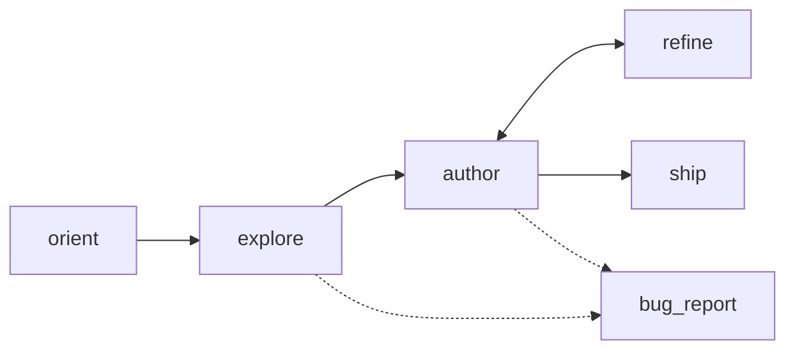

# aitester-bdd — agent skill for authoring `.robot` test suites

You are the agent. The user gave you a **story** (an intention to verify) and a **base URL**. Your job: produce ONE of two outputs.

1. **A `.robot` file** at `suite.robot` — the codified, deterministic test. Selectors grounded in snapshots you actually took. Runs without you afterwards (`robot suite.robot`).
2. **A bug report** at `triage/<story-slug>.md` — when the system itself is broken in a way that prevents you from authoring a meaningful test. Markdown. Brief. Names exactly where you got stuck.

No third option. You don't return a "best effort" suite that pretends to test something you couldn't actually drive. You either ground the test, or you tell the human the system is broken.



Use when: given a story + base URL, produce an aitester-bdd `.robot` suite.

Do not use when: there's no live target to drive (no URL); the user is hand-writing a one-off pytest; production CI is running already-shipped `.robot` files (those don't need you).

---

## 1 — Phases and the tools you use

| Phase | What you do | Tool |
|-------|-------------|------|
| Orient | Confirm env: RF, rfbrowser, agent-browser, LLM config. If rfbrowser is installed but NOT initialized, run `aitester init-browser` once. | `aitester doctor` |
| Explore | Drive the **live target** via `agent-browser`. Log in if needed, navigate the actual pages of the story, take snapshots at each step. Record selectors you can prove exist. | `agent-browser open / snapshot / click / type / ...` |
| Author | Write `suite.robot` using ONLY the keywords in § 4. Every selector must come from a snapshot you took during Explore. | Edit / Write |
| Review | `robot --dryrun` must pass cleanly. Fix any unknown-keyword / arg-shape errors. | `robot --dryrun suite.robot` |
| Refine | If a real run fails, re-explore the failing step, patch the suite. | `agent-browser` + edit |
| Ship | Hand `suite.robot` to the user. They run `robot suite.robot` without you. | — |

### Three runtime backends, one authored suite

The authored `.robot` declares only `Library  aitester_bdd.AITester`. At
run time, the walker dispatches to whichever backend `AITESTER_BROWSER`
selects. All three present the same DOM-driving surface; **the same
suite runs on all three.**

| Backend (`AITESTER_BROWSER=`) | When to pick | Setup needed |
|------------------------------|--------------|--------------|
| `agent-browser` (default) | Most cases. Same CLI you used during Explore, so the run-time DOM view is identical to the author-time one — no cross-driver selector drift. | None — the CLI ships its own browser. |
| `playwright` | Action-heavy tests where subprocess-per-call latency matters; in-process Playwright is faster. | `aitester init-browser` once (downloads Playwright browsers). |
| `nodriver` | Sites with bot detection (DataDome, Cloudflare Bot Management, PerimeterX, etc.) that fingerprint Playwright. Or when you want to skip the Playwright install entirely. | `pip install aitester-bdd[stealth]` + Edge or Chrome on the system. |

Picking a backend doesn't change the authored suite. It changes only
the driver underneath. If a test passes against `agent-browser` but
fails against `playwright` (or vice versa), that's a real cross-driver
DOM-view bug — file it. The default of `agent-browser` minimizes that
risk because the agent that authored the suite was already driving it.

### `agent-browser` quick reference

This is your eyes and hands during Explore. Sessions persist across calls — chain with `&&`.

```bash
agent-browser open <url>              # navigate
agent-browser snapshot                # accessibility tree of current page
agent-browser snapshot -c -d 3        # include CSS classes, depth 3
agent-browser get count '<css>'       # count matching elements
agent-browser get text '<css>'        # text content
agent-browser get html '<css>'        # outer HTML
agent-browser click '<css>'           # click
agent-browser type '<css>' '<text>'   # fill input
agent-browser eval '<js>'             # run JS in page context
agent-browser screenshot              # save PNG (for visual checks)
agent-browser close                   # tear down session
```

If `agent-browser` is missing, stop and tell the user — don't try to author blind.

### Exploration-first rule (non-negotiable)

Before you write a single selector in the suite, you must have driven that part of the flow live via `agent-browser` and confirmed:

- The entry URL loads (status, redirect target).
- The auth flow (if any) works with the credentials you'll bake into the suite.
- Every page the story passes through actually renders, and the elements you'll target are real.
- The terminal state of the story (the thing the test verifies) is observable on the page.

If any of those is not true, you do **NOT** invent a selector to cover the gap. You write a **bug report** (§ 1.2). Imagined selectors look like passing tests when they're really testing nothing.

### Bug report shape

When the system is broken in a way that prevents authoring a meaningful test, write `triage/<story-slug>.md` with:

```markdown
# Bug report: <story summary>

**Story:** <the user's intention, verbatim>
**Base URL:** <url>
**Stopped at step:** <which step in the story you could not codify>

## What I tried

- <each agent-browser command you ran and what came back>

## What I observed

- <the actual page state, error, or missing element>

## Why I cannot author the test

<one paragraph — what would need to be true for this story to be testable,
and what is not true today>
```

Keep it short. The point is to surface "system is broken here" to a human, not produce a runbook. End the bug report by naming exactly where you got stuck.

---

## 2 — Non-Negotiables

1. **You explore the live target via `agent-browser` BEFORE writing selectors.** Every selector in the suite must trace to a snapshot you took.
2. **Two outputs only:** a `.robot` suite, or a bug report. No half-authored "I hope this works" suites.
3. Output only valid Robot Framework syntax in `.robot` files.
4. All executable steps use `Given`, `When`, `Then`, `And`, or `But`.
5. Use the **shipped keyword library** (§ 4) — never invent site-specific keyword names.
6. Site specifics go in variables, arguments, continuation rows, and locators.
7. **Never use `When I wait ${ms} ms`** — use observation gates (§ 6.4).
8. **Dismiss selectors must be surgical** — they must not match interactive panels the test depends on (§ 6.5).
9. **Each rule has one purpose.** Login is a rule. Navigate-to-case is a rule. Approve is a rule. Compose with `And I declare parents`.
10. **Assertions live inside the rule that produced the state** — not in a separate end-state judge.
11. `robot --dryrun` must pass before you hand the suite to the user.
12. Semantic / visual_semantic checks (§ 4.3 escape hatch) only when deterministic checks genuinely can't express the assertion.

---

## 3 — Suite Format

Every suite follows this shape:

```robot
*** Settings ***
Documentation     Short summary of what this suite verifies
Library           aitester_bdd.AITester
Suite Setup       Given I start verification "${DEPLOYMENT}"
Suite Teardown    Then I finalize verification

*** Variables ***
${DEPLOYMENT}       prismi3-dev
${BASE_URL}         http://localhost:5173
${ADMIN_USER}       admin
${ADMIN_PASSWORD}   admin

*** Test Cases ***
Auth Flow                # one rule per test case OR rules grouped into one case
Case Approval Roundtrip  # the intention being verified
```

### Structural mapping (story → suite)

| Concept | Robot BDD shape |
|---------|----------------|
| deployment / target | `${DEPLOYMENT}`, `${BASE_URL}` variables |
| user intention | one Test Case |
| reusable setup (login) | a named rule + `And I declare parents` from later rules |
| state precondition | `Given url contains` / `And selector exists` *before* an action |
| user action | `When I click/type/select/...` |
| observation (async) | `And selector exists` / `And url matches` *after* an action |
| state assertion | `Then locator has text` / `Then count equals` / etc. |
| negative assertion | `But selector does not exist` / `But locator does not contain` |
| hooks / interrupts | `And I configure interrupts dismiss=` |

### Setup placement

- **Suite Setup** — `Given I start verification` — initialize run
- **Suite Teardown** — `Then I finalize verification` — emit Verdict, close browser, write log
- **Test Setup** (`[Setup]`) — per-test entry navigation (`Given I start scenario "name" at "${BASE_URL}"`)
- **State setup** — auth flow via `Given I configure state setup` (skip-when, click, type, password)

---

## 4 — Keyword Reference

`aitester_bdd.AITester` is a **generic** keyword library. All keywords are **deferred** — they record during test case definition and execute during the rule walk when the browser is live. Raw Browser library keywords in test cases will crash — use deferred keywords, `And I browser step`, or `And I call keyword` instead.

### 4.1 Verification Lifecycle

| Keyword | Purpose |
|---------|---------|
| `Given I start verification "${name}"` | Init verification run (Suite Setup) |
| `Then I finalize verification` | Walk the rule tree, emit Verdict, close browser (Suite Teardown) |
| `Given I start scenario "${name}" at "${url}"` | Begin one scenario at an entry URL (Test Setup) |
| `Given I start scenario "${name}"` | Begin one scenario without static entry (consume-driven) |

### 4.2 Rules

**`I define rule "${name}"`** — Named block within a test case. Body lines indented.

**`And I declare parents "${names}"`** — Comma-separated prerequisite rules. The walker runs parents first.

```robot
*** Test Cases ***
Case Approval Roundtrip
    [Setup]    Given I start scenario "approval" at "${BASE_URL}"
    I define rule "login"
        When I open "${BASE_URL}/login"
        When I type "${ADMIN_USER}" into locator "input[name=username]"
        When I type secret "${ADMIN_PASSWORD}" into locator "input[name=password]"
        When I click locator "button[type=submit]"
        And selector "[data-testid=overview-page]" exists
    I define rule "open_case"
        And I declare parents "login"
        When I click locator "a[href='#/case/MAIN-0168']"
        And url contains "/case/MAIN-0168"
        And selector "h1" exists
    I define rule "approve"
        And I declare parents "open_case"
        When I click locator "[data-testid=case-approve]"
        Then selector ".decision-badge[data-state=approved]" exists
        Then locator ".decision-badge" has text "Approved"
```

### 4.3 State Checks — position-determined (the ONE concept)

The engine has a single concept for "did the page reach the expected state?" — the **State Check**. Position relative to actions determines wait behavior and failure scope:

| Position | Role | Wait? | On fail |
|---|---|---|---|
| Before any action in the rule | **guard** (precondition) | no wait | skip the rule |
| After an action | **observation / assertion** | wait with timeout | fail the rule |

`Given`, `And`, `Then`, `But` are Robot grammar words for the human reader; the engine treats them identically. The position in the rule body is what matters.

The full keyword surface for state checks:

**URL**
| Keyword | Meaning |
|---|---|
| `Given/And/Then url contains "${pattern}"` | URL substring match |
| `Given/Then url matches "${regex}"` | URL regex match |
| `But url does not contain "${pattern}"` | Negative URL match |

**Element existence**
| Keyword | Meaning |
|---|---|
| `Given/And/Then selector "${css}" exists` | Element present |
| `But selector "${css}" does not exist` | Element absent |

**Counts**
| Keyword | Meaning |
|---|---|
| `Then count of locator "${css}" equals ${n}` | Exact |
| `Then count of locator "${css}" is at least ${n}` | Minimum |
| `Then count of locator "${css}" is at most ${n}` | Maximum |

**Element text**
| Keyword | Meaning |
|---|---|
| `Then locator "${css}" has text "${text}"` | Exact text |
| `Then locator "${css}" contains "${substring}"` | Substring |
| `Then locator "${css}" matches "${regex}"` | Regex |
| `But locator "${css}" does not contain "${substring}"` | Negative substring |

**Element state**
| Keyword | Meaning |
|---|---|
| `Then locator "${css}" is visible` / `is hidden` | Visibility |
| `Then locator "${css}" is enabled` / `is disabled` | Disabled attribute |
| `Then locator "${css}" is checked` | Checkbox/radio |
| `Then locator "${css}" has class "${name}"` | Class present |
| `But locator "${css}" does not have class "${name}"` | Class absent |

**Attributes & form values**
| Keyword | Meaning |
|---|---|
| `Then locator "${css}" has attribute "${attr}" equal to "${value}"` | Attribute value |
| `Then locator "${css}" has attribute "${attr}" containing "${sub}"` | Attribute substring |
| `Then input "${css}" has value "${value}"` | Form input |
| `Then select "${css}" has selected "${value}"` | Dropdown |

**Network / API** (live backend assertions — proves persistence, not just rendering)
| Keyword | Meaning |
|---|---|
| `Then last response status equals ${code}` | Last network response code |
| `Then last response body contains "${text}"` | Last response body substring |
| `Then api "${path}" returns "${field}" equal to "${value}"` | Direct API check via session token |

**Semantic (AI-judged)** — use sparingly, slow and non-deterministic
| Keyword | Meaning |
|---|---|
| `Then content of locator "${css}" semantically matches "${prompt}"` | LLM judges rendered content |
| `Then page semantically matches "${prompt}"` | LLM judges full-page state |

### 4.4 Actions — Navigation

| Keyword | Purpose |
|---------|---------|
| `When I open "${url}"` | Navigate to URL |
| `When I reload` | Reload current page (proves state persists) |
| `When I add url params "${params}"` | Append query params and navigate |
| `When I go back` | Browser back |

### 4.5 Actions — Interaction

| Keyword | Options |
|---------|---------|
| `When I click locator "${css}"` | `await=<selector>` |
| `When I click text "${text}"` | `await=<selector>` |
| `When I double click locator "${css}"` | |
| `When I type "${value}" into locator "${css}"` | `await=<selector>` |
| `When I type secret "${value}" into locator "${css}"` | (logs `***` instead of value) |
| `When I select "${value}" from locator "${css}"` | |
| `When I check locator "${css}"` / `When I uncheck locator "${css}"` | |
| `When I hover locator "${css}"` / `When I focus locator "${css}"` | |
| `When I press keys "${css}"` | Keys as continuation args |
| `When I upload file "${path}" to locator "${css}"` | |
| `When I set stepper "${css}" to ${count}` | Click a self-re-rendering stepper N times via JS-click (avoids Playwright stability errors) |
| `When I select date "${YYYY-MM-DD}"` | Navigate ARIA datepicker to target month, click day; options: `forward=<css>`, `heading=<css>`, `max_clicks=<n>` |

### 4.6 Per-rule policy

| Keyword | Purpose |
|---------|---------|
| `And I set retry ${max} times with ${delay} ms delay` | If guards fail, replay body + recheck up to N times |
| `And I set guard policy "${policy}"` | `skip` (default) or `abort` (raise to stop whole walk) |
| `And I set rule timeout ${ms} ms` | Per-rule deadline; body exceeding it fails the rule |
| `And I pause interrupts` | Suppress dismiss-overlays inside this rule (when testing the modal itself) |
| `And I scope interrupts to "${selectors}"` | Replace the verification-wide dismiss list for this rule (comma-separated) |
| `And I screenshot on enter` | Snapshot when the rule starts (for debugging entry state) |
| `And I screenshot on fail` | Snapshot on any failure within the rule |

### 4.7 Expansion (parametric scenarios)

| Keyword | Purpose |
|---------|---------|
| `When I expand over elements "${css}"` | Run child rules per matched element; options: `limit=`, `exclude_if=` |
| `When I expand over data "${path}"` | Run child rules per CSV/JSON row |
| `When I expand over combinations` | Cartesian product across `control=`/`values=` axes |

### 4.8 Hooks & Interrupts

| Keyword | Purpose |
|---------|---------|
| `And I register hook "${name}" at "${point}"` | Points: `before_scenario`, `after_scenario`, `before_rule`, `after_rule`, `on_failure` |
| `And I configure interrupts` | Auto-dismiss overlays: `dismiss=<css>` (must be surgical — § 6.4) |
| `And I configure state setup` | Pre-test auth: `skip_when=<url>`, `action=open url=`, `action=input css= value=`, `action=password css= value=`, `action=click css=` |

### 4.9 Timing & Debug

| Keyword | Notes |
|---------|-------|
| `When I scroll down` | One viewport height |
| `When I wait for idle` | Network idle (sparingly — observation gates preferred) |
| `When I take screenshot` | Optional: `filename=<path>` — auto-fires on rule failure if `on_failure` hook installed |

### 4.10 Passthrough (escape hatches)

| Keyword | Notes |
|---------|-------|
| `And I browser step "${method}"` | Defer one Browser library call |
| `And I call keyword "${name}"` | Defer any RF keyword (runs during walk) |
| `And I evaluate js "${script}"` | Defer JS — use only when no declarative keyword exists |

**Keyword preference order:**
1. Deferred BDD keywords from this library
2. `And I call keyword` (multi-step RF flows in `*** Keywords ***`)
3. `And I browser step` (raw Browser method)
4. `And I evaluate js` (last resort)

---

## 5 — Starter Template

```robot
*** Settings ***
Documentation     Smoke test: login + open a case + verify it renders
Library           aitester_bdd.AITester
Suite Setup       Given I start verification "${DEPLOYMENT}"
Suite Teardown    Then I finalize verification

*** Variables ***
${DEPLOYMENT}       prismi3-dev-smoke
${BASE_URL}         http://localhost:5173
${ADMIN_USER}       admin
${ADMIN_PASSWORD}   admin

*** Test Cases ***
Login And Open Case
    [Setup]    Given I start scenario "login_open_case" at "${BASE_URL}"
    I define rule "login"
        When I open "${BASE_URL}/login"
        When I type "${ADMIN_USER}" into locator "input[name=username]"
        When I type secret "${ADMIN_PASSWORD}" into locator "input[name=password]"
        When I click locator "button[type=submit]"
        And selector "[data-testid=overview-page]" exists
    I define rule "open_case"
        And I declare parents "login"
        When I open "${BASE_URL}/#/case/MAIN-0168"
        Then locator "h1" has text "RetryableClientTransaction|core"
        Then locator "[data-testid=case-tags]" contains "smartstore"
```

---

## 6 — Patterns

### 6.1 Auth flow (pure action rule + observation gate)

```robot
I define rule "login"
    When I open "${BASE_URL}/login"
    When I type "${ADMIN_USER}" into locator "input[name=username]"
    When I type secret "${ADMIN_PASSWORD}" into locator "input[name=password]"
    When I click locator "button[type=submit]"
    And selector "[data-testid=overview-page]" exists    # observation gate
```

The trailing `And selector ... exists` is an **observation gate** — the engine waits for that element to appear before proceeding. Without it, downstream rules may execute before the SPA hydrates.

### 6.2 Compose via parent rules (don't repeat yourself)

```robot
I define rule "login"
    # ... as above

I define rule "open_case_main_0168"
    And I declare parents "login"
    When I open "${BASE_URL}/#/case/MAIN-0168"
    And selector "[data-testid=case-detail]" exists

I define rule "approve"
    And I declare parents "open_case_main_0168"
    When I click locator "[data-testid=case-approve]"
    Then locator ".decision-badge" has text "Approved"
```

Each rule states only its own work; the walker resolves the parent chain.

### 6.3 Persistence across reload (real-state assertion)

```robot
I define rule "approve_persists"
    And I declare parents "approve"
    When I reload
    Then locator ".decision-badge" has text "Approved"
    # The reload pulls fresh state from the backend.
    # If approve only updated client state, this rule will fail.
```

### 6.4 Observation gates (async dependencies)

**Never use `When I wait ${ms} ms`.** Three patterns:

**Option A — Split rules** (named state transitions worth their own milestone):

```robot
I define rule "type_search"
    When I type "MAIN-0168" into locator "[data-testid=search-input]"
I define rule "results_appear"
    And I declare parents "type_search"
    And selector "[data-testid=search-result-0]" exists
I define rule "click_result"
    And I declare parents "results_appear"
    When I click locator "[data-testid=search-result-0]"
```

**Option B — Inline `await=`** (low-level async within one user intent):

```robot
I define rule "search_and_select"
    When I type "MAIN-0168" into locator "[data-testid=search-input]"
    ...    await=[data-testid='search-result-0']
    When I click locator "[data-testid=search-result-0]"
```

**Option C — Interleaved state check** (observation between actions):

```robot
I define rule "fill_form"
    When I type "admin" into locator "input[name=username]"
    And selector "input[name=password]" exists
    When I type secret "secret" into locator "input[name=password]"
```

```
Pick which?
  Is the observation a meaningful named milestone?
  ├── Yes → Split rules (Option A)
  └── No → Low-level async within one intent?
      ├── Yes → await= (Option B)
      └── No → Interleaved state check (Option C)
```

### 6.5 Dismiss scoping (interrupts that don't break the test)

```robot
And I configure interrupts dismiss=text="Got it"
And I configure interrupts dismiss=[data-testid='cookie-banner'] button
```

**Critical:** dismiss selectors must NOT match interactive panels the flow depends on (search bars, calendars, decision dialogs).

| Good | Bad |
|------|-----|
| `text="Got it"` | `[role="dialog"] button` |
| `[data-testid="cookie-banner"] button` | `button[aria-label="Close"]` |
| `.promo-overlay .dismiss` | `[data-testid="modal-container"] button` |

### 6.6 Negative assertions (the thing must NOT happen)

```robot
I define rule "no_approve_for_viewer"
    And I declare parents "login_as_viewer"
    When I open "${BASE_URL}/#/case/MAIN-0168"
    But selector "[data-testid=case-approve]" does not exist
    But locator "[data-testid=role-warning]" contains "viewer"
```

### 6.7 Network / API persistence check (proves backend wrote, not just frontend rendered)

```robot
I define rule "approve_in_backend"
    And I declare parents "approve"
    Then api "/api/cases/MAIN-0168" returns "human_decision" equal to "approved"
```

This hits the backend directly via the active session cookie. Catches frontend-only updates that don't persist.

### 6.8 Multi-scenario coverage in one suite

```robot
*** Test Cases ***
Approve Flow
    [Setup]    Given I start scenario "approve" at "${BASE_URL}"
    I define rule "login"
        # ...
    I define rule "approve"
        And I declare parents "login"
        # ...

Defer Flow
    [Setup]    Given I start scenario "defer" at "${BASE_URL}"
    I define rule "login"
        # ...
    I define rule "defer"
        And I declare parents "login"
        # ...
```

Each test case is independent. The walker resets browser state between test cases unless `[Setup]` says otherwise.

---

## 7 — Validation

Two gates — run both before considering a suite done:

```bash
# 1. BDD structure check + keyword resolution
robot --dryrun --output NONE --log NONE --report NONE suite.robot

# 2. Actual execution against live target
robot --variable BASE_URL:http://localhost:5173 suite.robot
```

If dryrun fails: refine the suite (the engine will surface the specific keyword that didn't resolve).
If execution fails: read `log.html`, find the failing rule, snapshot at the failure point, refine the selectors or guards/observations.

---

## 8 — Agent Contract

You agreed to all of these by invoking this skill:

1. **Drive the live target first.** Open it. Snapshot it. Log in if needed. Click through the actual flow. Take a fresh snapshot at every page transition. Only then start writing the `.robot`.
2. **No imagined selectors.** Every selector in the suite must trace to a snapshot you took. If a selector is uncertain, snapshot again or write a bug report — do not guess.
3. **Use shipped keywords only.** No site-specific verbs. If the keyword you want doesn't exist, prefer `And I call keyword "name"` with a `*** Keywords ***` block (visible RF code) over `And I evaluate js` (opaque JS).
4. **One rule = one named transition.** Decompose compound flows into multiple rules with parent declarations.
5. **Position-determined state checks.** Before an action = guard. After an action = observation gate / assertion.
6. **Assertions go inside the rule that produced the state.** Do not delay assertions to a separate "judge rule."
7. **Refine, don't restart.** When dryrun or live run fails, re-explore the failing step, patch the existing suite; don't rewrite from scratch.
8. **Variables for site specifics, locators for selectors.** Suite must be readable at the rule level.
9. **Two outputs only.** A `.robot` suite that you stand behind, or a bug report in `triage/`. Not "best effort" garbage.

### What the agent must NOT do

| Bad | Good |
|-----|------|
| Author the suite without ever calling `agent-browser` | Drive the live flow first, then write |
| `When I navigate to the case detail page` | `When I open "${BASE_URL}/#/case/MAIN-0168"` |
| `Then I see the approved badge` | `Then locator ".decision-badge" has text "Approved"` |
| `When I wait 3 seconds for the page to load` | `And selector "[data-testid=overview-page]" exists` |
| `When I click the approve button` | `When I click locator "[data-testid=case-approve]"` |
| Guess a selector that "probably exists" | Snapshot again, or write a bug report |
| Ship a suite that dryrun-fails | `robot --dryrun` clean is required before handoff |

---

## 9 — Authoring Shape

Treat the `.robot` file as the public spec of what's verified:

| Concept | Shape |
|---------|-------|
| Target | Suite variables + `Given I start verification` |
| Scenario | One test case |
| Setup chain | Parent rules (login → navigate → action) |
| State precondition | `Given/And` state check before an action |
| User action | `When` |
| Observation | `And` state check after an action |
| Outcome | `Then` assertion (positive) / `But` (negative) |
| Persistence proof | A rule with `When I reload` followed by re-asserting state |
| Coverage | Multiple test cases sharing parent rules |

Avoid collapsing the flow into one opaque keyword. If a keyword doesn't exist for what you need, prefer `And I call keyword "name"` with a `*** Keywords ***` block (visible RF code) over `And I evaluate js` (opaque JS).

### Async dependencies — what to look for during explore

| Action | What to observe | Example selector |
|--------|----------------|------------------|
| Click button → SPA route change | URL changes, new page renders | `[data-testid=detail-view]` |
| Type into search | Autocomplete results | `[data-testid=search-result-0]` |
| Submit form | Toast or redirect | `[role=alert]` or URL change |
| Click action → backend write | State badge updates after API roundtrip | `.decision-badge[data-state=approved]` |
| Page load → SSE stream | Content streams in | `[data-streaming=done]` or count of items |

Record each as a pair: triggering action + completion selector. These become observation gates in the draft.

---

## 10 — Reference Files

| File | Purpose |
|------|---------|
| `examples/quickstart/login_smoke.robot` | Minimal working example — login + open case + verify renders |
| `engine/README.md` | The walker's gotcha-fix map (what it handles for you at run time) |

## 11 — Common patterns for `agent-browser` during Explore

```bash
# Discover what's at the entry URL
agent-browser open "${BASE_URL}" && agent-browser snapshot

# Drive an auth flow before the actual test surface exists
agent-browser open "${BASE_URL}/#/login" \
  && agent-browser type 'input[name=username]' 'admin' \
  && agent-browser type 'input[name=password]' 'admin' \
  && agent-browser click 'button[type=submit]' \
  && agent-browser snapshot          # confirm the post-login page

# Reach the page the story is about, snapshot every transition
agent-browser open "${BASE_URL}/#/case/MAIN-0168" \
  && agent-browser snapshot

# Probe an interactive element you intend to use in the suite
agent-browser get count '[data-testid=case-approve]'

# Take a screenshot if you'll need a visual_semantic check
agent-browser screenshot
```

After each `snapshot`, note: the selectors you'll use, the data-testids you saw, the URL the SPA is now on, the text content of elements you'll assert against. Only THEN open the editor and write `suite.robot`.

## 12 — Emit: intention-driven, never auto-dumped

The walker has an **explicit emit** primitive — `And I emit "${name}"` —
that captures structured page state into `<output_dir>/emit.jsonl` at
the position of the step in the rule. **You** decide whether to write
emit calls based on the story's intent. The walker does NOT auto-emit
on failure; failure diagnosis is done by the AOP `diagnose` aspect (see
§ 13), which writes natural-language explanations to `failures.jsonl`.

### Intention → emit decision

| Story type | Cues in the story | Explicit emit? |
|------------|-------------------|-----------------|
| **Smoke / regression** | "verify X works", "log in and see Y" | **no** — keep the suite fast and binary; rely on the diagnose aspect for failures |
| **Diagnostic probe** | "what is on the page", "snapshot the dashboard's metrics", "capture the table" | **heavy** — emit the data the human will read |
| **Differential / longitudinal** | "track how Y changes between runs", "produce a baseline" | **structured** — emit deterministic field names so diffs work |
| **Bug-repro instrumentation** | "reproduce the bug where Y misbehaves when X", "capture state right before the broken step" | **targeted** — emit only around the suspected fault |

### Syntax

```robot
And I emit "${name}"
...    field=<name> source=<text|attr|count|html|value|class|is_visible|is_enabled|is_checked|js>
...                 locator=<css>       # required for everything except js
...                 attr=<attr>         # required for source=attr
...                 expr=<js>           # required for source=js (free-form expression)
```

Each `field=...` starts a new field; sibling `source=/locator=/attr=/expr=`
keys belong to the most recent `field=`. Multiple fields per emit
statement is normal.

### Example: diagnostic probe of a dashboard

```robot
I define rule "dashboard_loaded"
    And I declare parents "login"
    When I open "${BASE_URL}/dashboard"
    And selector "[data-testid=dashboard-root]" exists
    And I emit "dashboard_state"
    ...    field=case_count    source=count    locator=".case-row"
    ...    field=first_title   source=text     locator=".case-row:first-child .title"
    ...    field=status         source=attr     locator="[data-testid=status]"  attr=data-state
    ...    field=visible        source=is_visible  locator=".empty-state"
```

### Human-edit affordance

The `.robot` is text. After authoring, the user may:
- Add an emit row to a passing smoke test that's intermittently failing,
  to debug the flake.
- Remove emit rows from a diagnostic suite once it's stabilized into a
  regression test.

Either is normal. Don't over-emit at authoring time — each emit row
costs one or more page queries.

---

## 13 — Failure diagnosis: an AOP aspect, not your concern

When a rule fails, the walker's AOP `diagnose` aspect fires automatically:

1. Hands the LLM (same `cc/claude-opus-4-7` backend by default) the
   verification + scenario + rule + failed step + expected/observed +
   the **full MDP trajectory** recorded by the `trajectory` aspect.
2. Asks: "why did this rule likely fail? Is the cause in the SUT or
   in the test?"
3. Writes the answer to `RuleResult.ai_diagnosis` (shown in the
   verdict output) AND appends a structured record to
   `<output_dir>/failures.jsonl`.

You do not need to instrument anything for this. The diagnose aspect is
always on. Disable via `AITESTER_DISABLE_ASPECTS=diagnose` if running in
a CI environment without an LLM endpoint.

Persistence summary (all paths honor `AITESTER_EMIT_DIR`, falling back
to RF's `${OUTPUT_DIR}` or cwd):

| File | Written by | Purpose |
|------|-----------|---------|
| `emit.jsonl` | explicit `And I emit "..."` | structured page-state captures for diagnostic/probe suites |
| `walk_log.jsonl` | `trajectory` aspect | every MDP transition (rule_enter, before/after_action, state_check, dismiss, emit, rule_exit) — full episode record |
| `failures.jsonl` | `diagnose` aspect | one record per rule failure with the AI-written diagnosis + the deterministic failure context |

---

## 14 — When to file a bug report instead

You write `triage/<story-slug>.md` (NOT a `.robot` suite) when any of these is true after a real exploration attempt:

- The base URL is unreachable, returns 5xx, or redirects to a page unrelated to the story.
- The auth flow specified in the story doesn't accept the credentials provided.
- The page the story is about doesn't render, errors out, or is missing the element the story is about ("approve case" but no approve button exists).
- The terminal state the story wants to verify is not observable (story says "the decision persists" but the page shows no decision indicator anywhere).
- The agent-browser CLI itself errors out repeatedly (target not driveable).

Do NOT file a bug report for:
- Selectors you couldn't guess — that's a "take another snapshot" problem, not a bug.
- An async timing issue — that's an observation-gate problem, fix it with `await=` or split rules.
- A dryrun failure — that's a refine problem, patch the suite.

The bug report exit is for "the system is genuinely broken or absent in a way that makes this story untestable today." Not for your authoring difficulties.
