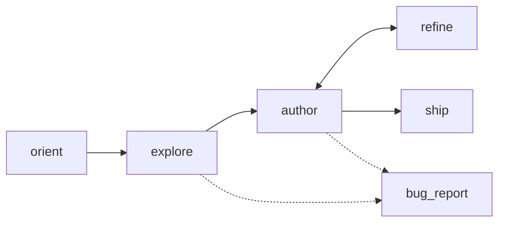

# aitester-bdd — agent skill for authoring `.robot` test suites

You are the agent. The user gave you a **story** (an intention to verify) and a **base URL**. Your job: produce ONE of two outputs.

1. **A `.robot` file** at `suite.robot` — the codified, deterministic test. Selectors grounded in snapshots you actually took. Runs without you afterwards (`robot suite.robot`).
2. **A bug report** at `triage/<story-slug>.md` — when the system itself is broken in a way that prevents you from authoring a meaningful test. Markdown. Brief. Names exactly where you got stuck.

No third option. You don't return a "best effort" suite that pretends to test something you couldn't actually drive. You either ground the test, or you tell the human the system is broken.



Use when: given a story + base URL, produce an aitester-bdd `.robot` suite.

Do not use when: there's no live target to drive (no URL); the user is hand-writing a one-off pytest; production CI is running already-shipped `.robot` files (those don't need you).

---

## 1 — Phases and the tools you use

| Phase | What you do | Tool |
|-------|-------------|------|
| Orient | Confirm env: RF, Playwright explorer chromium, LLM config. If missing, run `aitester init-browser`. | `aitester doctor` |
| Explore | Drive the **live target** via the Playwright `browser_*` tools. Log in if needed, navigate the pages the story passes through, take a `browser_snapshot` at each step. Record selectors you can prove exist. | `browser_open / browser_snapshot / browser_click / browser_type / ...` |
| Author | Write `suite.robot` using ONLY the keywords in § 4. Every selector must come from an attribute in a `browser_snapshot` you took. Declare `${ENGINE}` in `*** Variables ***`. | `write_robot_suite` tool |
| Review | `robot --dryrun` must pass cleanly. Fix any unknown-keyword / arg-shape errors. | `robot --dryrun suite.robot` |
| Refine | If a real run fails, re-explore the failing step via `browser_*` tools, patch the suite. | `browser_*` + edit |
| Ship | Hand `suite.robot` to the user. They run `robot suite.robot` without you. | — |

### One explorer, three runtime backends

**Exploration is Playwright only.** That's the only browser dialect
that exposes real CSS-grounded attributes natively. Authoring drives
Playwright sync API via the tools listed below; every selector in the
authored suite comes from a real `browser_snapshot` entry.

**Run-time backend is your choice, declared in the suite.** All three
runtime backends accept CSS selectors, so the same authored `.robot`
runs on any of them. Pick by setting `${ENGINE}` in `*** Variables ***`:

```robot
*** Variables ***
${ENGINE}    agent-browser   # or "playwright" or "nodriver"
```

`aitester run` reads `${ENGINE}` and sets `AITESTER_BROWSER` so the
walker picks the matching backend.

| `${ENGINE}` value | When to pick | Run-time setup needed |
|-------------------|--------------|------------------------|
| `agent-browser` (default for new suites) | Zero install at run time. CLI ships its own browser. | None at run time. |
| `playwright` | Action-heavy tests where in-process Playwright is faster than subprocess-per-call. | `aitester init-browser` once. |
| `nodriver` | Sites with bot detection (DataDome / Cloudflare BM / etc.) that fingerprint Playwright. | `pip install aitester-bdd[stealth]` + Edge/Chrome on the system. |

Picking a backend doesn't change the authored suite. If a test passes
against one runtime but fails on another, that's a real cross-driver
DOM-view bug worth filing. CSS is the lingua franca of all three.

### Playwright explorer tool reference

Your eyes and hands during Explore. Tools are exposed by the agent
loop and call Playwright sync API in a worker thread. A single
browser session is maintained across all tool calls — `browser_open`
once, then issue many `browser_snapshot` / `browser_click` etc.
against the same page.

| Tool | Purpose |
|------|---------|
| `browser_open(url)` | Navigate. Persistent session. |
| `browser_snapshot()` | **Your source of truth for selectors.** Returns URL + title + a list of interactive/landmark elements with their real attributes (`data-testid`, `placeholder`, `aria-label`, `id`, `name`, `type`, `role`, `href`, `class`). Call after every navigation or action that changes the page. |
| `browser_click(css)` | Click. CSS selector. |
| `browser_type(css, text)` | Fill an input (clears first). |
| `browser_get_text(css)` | Inner text of first matching element. |
| `browser_get_count(css)` | Number of matching elements. |
| `browser_get_html(css)` | Outer HTML of first match — use when snapshot's per-element summary isn't enough (need full child tree, exact class list, etc.). |
| `browser_get_attr(css, name)` | Single attribute value. |
| `browser_eval(js)` | Run JS in page context. |
| `browser_screenshot(path)` | Save PNG. |
| `browser_close()` | Tear down session. |
| `read_file(path)` | (white-box mode only) Read a source file under the configured source_root — useful for finding `data-testid` declarations or route mounts in the source code. |

### Selector priority (non-negotiable)

When constructing a CSS selector from a `browser_snapshot` entry, pick
the most stable available attribute in this order:

1. **`[data-testid="..."]`** — most stable; never inferred, always real
2. **`role+name`** — for buttons/links with accessible names
3. **`[aria-label="..."]`**
4. **`[id="..."]`** when not auto-generated (avoid `id="r:0:"` etc.)
5. **`[name="..."]`** for form inputs
6. **`[placeholder="..."]`** when nothing better
7. Stable class (no `Mui-...-12345`-style hash)
8. Visible text via `:has-text("...")` — last resort

### Selector anti-patterns and robust authoring

The agent (you) **must avoid** these failure modes — they pass dryrun
but break at run time:

**Don't compound multiple Tailwind/utility classes.** When `browser_snapshot`
shows `<div class="prose prose-sm dark:prose-invert break-words max-h-80
overflow-hidden">`, **do NOT** author `div.prose.max-h-80` — `max-h-80`
is conditional (only present when content is long+collapsed). Pick ONE
distinctive class:

| Bad | Why bad | Good |
|-----|---------|------|
| `div.prose.max-h-80` | `max-h-80` is conditional | `div.prose-sm` |
| `button.bg-primary.rounded-2xl.px-4` | three Tailwind utilities; any may shift | `button[type=submit]` |
| `div.flex.justify-end.gap-2.mt-4` | utility soup | `div.justify-end` (if distinctive) or just the inner content |

If you don't know which class is conditional, **use containment**:
`[class*="prose-sm"]` matches as long as `prose-sm` appears anywhere in
the class list, robust to siblings being added/removed.

**Prefer pipe-fallback when uncertain.** The runtime resolves
`a | b | c` to "the first selector that matches on the live page" —
use this when an element might be reachable via one of several
attributes:

```robot
# data-testid preferred; fall back to a stable id, then a class
When I click locator "[data-testid=submit-btn] | #submit | button.primary"

# match either the old or new layout's user message bubble
Then locator ".justify-end .bg-primary | [data-testid=user-msg]" contains "Hello"
```

Use this sparingly — every fallback is a maintenance hint that the
selector is fragile. Prefer asking the SUT team to add a `data-testid`
(write a **bug report** if testids are missing on a critical element).

**Compound selectors are OK when they target uniquely.** `.justify-end
.bg-primary.rounded-2xl` (parent + child class) is fine if both halves
are stable. The anti-pattern is compounding *peer* Tailwind classes
that may individually disappear.

### A good selector is unique, robust, and scoped

Three properties — they reinforce each other, none is optional:

- **Unique.** Exactly one element matches (`count == 1`) for
  click/type/observe targets. For table rows / list items, `count >= 1`.
  A non-unique selector is the #1 source of false-pass + false-fail
  flakiness — Playwright's `.first` masks the bug at runtime.
- **Robust.** Keys on a stable attribute (`data-testid`, `aria-label`,
  semantic role, `id`, `name`, `href`) rather than visual class soup
  that shifts with theme/variant changes.
- **Scoped.** When a selector isn't unique page-wide but IS unique
  inside a card / panel / row, use `And I scope children to "${parent}"`
  to narrow the context. Scoping turns "the second button" into
  "the only button inside the case-detail card" — far more readable
  and survives layout reflow.

### Validate every selector before you write it

Before you put a CSS selector into the `.robot` suite, call
`browser_validate_selector(css, scope, expected)`. It runs the
selector against the live page and returns:

```
{
  "candidate": "<css under scope>",
  "count": 1,
  "expected": "unique",
  "ok": true,
  "stable_attrs": {"data-testid": "submit-btn"},
  "classes": ["px-4", "py-2", "bg-blue-600"],
  "text": "Submit"
}
```

Read it like this:

- `ok: false, count: 0` → selector doesn't match. Re-snapshot, the
  element may not be rendered (add an `await`), or the spelling is
  wrong.
- `ok: false, count > 1` → not unique. The report's `suggestion` field
  names a stable attribute to tighten to (e.g. `tighten to
  [data-testid="submit-btn"]`). If no stable attr is available, add a
  parent scope.
- `warning: "selector is built only from Tailwind utility classes"` →
  brittle. Replace with a semantic anchor.
- For pipe-fallback (`a | b | c`), each candidate is validated
  independently — the report is one entry per candidate.

`expected` values:
- `"unique"` (default) — for click, type, single-element observations
- `"many"` — for table rows, list items, expansion targets
- `"absent"` — for negation/disappearance asserts (`But selector ...
  does not exist`)

This is **fast** (one tool call per selector) and catches every
"oops, that matches three things" mistake before the suite ships.

### Post-authoring validate-refine pass (lightweight)

After you've drafted the `.robot` body but BEFORE calling
`write_robot_suite`, do a quick sanity sweep:

1. For each selector you put in the suite, run
   `browser_validate_selector` once more — confirm `ok: true`.
2. If any selector now reports `ok: false` (state may have changed
   during exploration), fix it in place: tighten the attribute, add
   scope, or escalate to a bug report if the element is genuinely
   missing.
3. Only then call `write_robot_suite`. The runtime walker will
   resolve pipe-fallbacks and scopes the same way the validator did,
   so a green validation == a green run (modulo timing, which you
   handle with `await=`).

Keep the refinement minimal — this is a "second look" pass, not a
rewrite. If a selector required more than one fix, that's a signal
the underlying page contract is unstable and a bug report may be the
right exit.

### Exploration-first rule (non-negotiable)

Before you write a single selector in the suite, you must have driven
that part of the flow live via the Playwright browser tools and
confirmed:

- The entry URL loads.
- The auth flow (if any) works with the credentials you'll bake into the suite.
- Every page the story passes through actually renders, and the elements you'll target appear in a `browser_snapshot` you took.
- The terminal state of the story (the thing the test verifies) is observable on the page.

**Selectors in the authored suite MUST come from the snapshot's attribute output.** If `browser_snapshot` shows `<input placeholder="Username">` with no `data-testid`, your selector is `input[placeholder="Username"]` — not the made-up `input[autocomplete=username]`. If you find yourself guessing, take another snapshot or call `browser_get_html(css)` to see the actual outerHTML.

If the page is broken in a way that prevents authoring, you do **NOT** invent a selector to cover the gap. You write a **bug report** (§ 1.2).

### Bug report shape

When the system is broken in a way that prevents authoring a meaningful test, write `triage/<story-slug>.md` with:

```markdown
# Bug report: <story summary>

**Story:** <the user's intention, verbatim>
**Base URL:** <url>
**Stopped at step:** <which step in the story you could not codify>

## What I tried

- <each agent-browser command you ran and what came back>

## What I observed

- <the actual page state, error, or missing element>

## Why I cannot author the test

<one paragraph — what would need to be true for this story to be testable,
and what is not true today>
```

Keep it short. The point is to surface "system is broken here" to a human, not produce a runbook. End the bug report by naming exactly where you got stuck.

---

## 2 — Non-Negotiables

1. **You explore the live target via the Playwright `browser_*` tools BEFORE writing selectors.** Every selector in the suite must trace to an attribute in a `browser_snapshot` you took. No inferring from common HTML conventions.
2. **Two outputs only:** a `.robot` suite, or a bug report. No half-authored "I hope this works" suites.
3. Output only valid Robot Framework syntax in `.robot` files.
4. All executable steps use `Given`, `When`, `Then`, `And`, or `But`.
5. Use the **shipped keyword library** (§ 4) — never invent site-specific keyword names.
6. Site specifics go in variables, arguments, continuation rows, and locators.
7. **Never use `When I wait ${ms} ms`** — use observation gates (§ 6.4).
8. **Dismiss selectors must be surgical** — they must not match interactive panels the test depends on (§ 6.5).
9. **Each rule has one purpose.** Login is a rule. Navigate-to-case is a rule. Approve is a rule. Compose with `And I declare parents`.
10. **Assertions live inside the rule that produced the state** — not in a separate end-state judge.
11. `robot --dryrun` must pass before you hand the suite to the user.
12. Semantic / visual_semantic checks (§ 4.3 escape hatch) only when deterministic checks genuinely can't express the assertion.

---

## 3 — Suite Format

Every suite follows this shape:

```robot
*** Settings ***
Documentation     Short summary of what this suite verifies
Library           aitester_bdd.AITester
Suite Setup       Given I start verification "${DEPLOYMENT}"
Suite Teardown    Then I finalize verification

*** Variables ***
${ENGINE}           agent-browser        # runtime backend; aitester run reads this
${DEPLOYMENT}       prismi3-dev
${BASE_URL}         http://localhost:5173
${ADMIN_USER}       admin
${ADMIN_PASSWORD}   admin

*** Test Cases ***
Auth Flow                # one rule per test case OR rules grouped into one case
Case Approval Roundtrip  # the intention being verified
```

`${ENGINE}` selects the runtime backend: `agent-browser` (default,
zero install at run time), `playwright` (faster but needs `rfbrowser
init`), or `nodriver` (bot-resistant, needs `aitester-bdd[stealth]`).
Exploration is always Playwright regardless of this value.

### Structural mapping (story → suite)

| Concept | Robot BDD shape |
|---------|----------------|
| deployment / target | `${DEPLOYMENT}`, `${BASE_URL}` variables |
| user intention | one Test Case |
| reusable setup (login) | a named rule + `And I declare parents` from later rules |
| state precondition | `Given url contains` / `And selector exists` *before* an action |
| user action | `When I click/type/select/...` |
| observation (async) | `And selector exists` / `And url matches` *after* an action |
| state assertion | `Then locator has text` / `Then count equals` / etc. |
| negative assertion | `But selector does not exist` / `But locator does not contain` |
| hooks / interrupts | `And I configure interrupts dismiss=` |

### Setup placement

- **Suite Setup** — `Given I start verification` — initialize run
- **Suite Teardown** — `Then I finalize verification` — emit Verdict, close browser, write log
- **Test Setup** (`[Setup]`) — per-test entry navigation (`Given I start scenario "name" at "${BASE_URL}"`)
- **State setup** — auth flow via `Given I configure state setup` (skip-when, click, type, password)

---

## 4 — Keyword Reference

`aitester_bdd.AITester` is a **generic** keyword library. All keywords are **deferred** — they record during test case definition and execute during the rule walk when the browser is live. Raw Browser library keywords in test cases will crash — use deferred keywords, `And I browser step`, or `And I call keyword` instead.

### 4.1 Verification Lifecycle

| Keyword | Purpose |
|---------|---------|
| `Given I start verification "${name}"` | Init verification run (Suite Setup) |
| `Then I finalize verification` | Walk the rule tree, emit Verdict, close browser (Suite Teardown) |
| `Given I start scenario "${name}" at "${url}"` | Begin one scenario at an entry URL (Test Setup) |
| `Given I start scenario "${name}"` | Begin one scenario without static entry (consume-driven) |

### 4.2 Rules

**`I define rule "${name}"`** — Named block within a test case. Body lines indented.

**`And I declare parents "${names}"`** — Comma-separated prerequisite rules. The walker runs parents first.

```robot
*** Test Cases ***
Case Approval Roundtrip
    [Setup]    Given I start scenario "approval" at "${BASE_URL}"
    I define rule "login"
        When I open "${BASE_URL}/login"
        When I type "${ADMIN_USER}" into locator "input[name=username]"
        When I type secret "${ADMIN_PASSWORD}" into locator "input[name=password]"
        When I click locator "button[type=submit]"
        And selector "[data-testid=overview-page]" exists
    I define rule "open_case"
        And I declare parents "login"
        When I click locator "a[href='#/case/MAIN-0168']"
        And url contains "/case/MAIN-0168"
        And selector "h1" exists
    I define rule "approve"
        And I declare parents "open_case"
        When I click locator "[data-testid=case-approve]"
        Then selector ".decision-badge[data-state=approved]" exists
        Then locator ".decision-badge" has text "Approved"
```

### 4.3 State Checks — position-determined (the ONE concept)

The engine has a single concept for "did the page reach the expected state?" — the **State Check**. Position relative to actions determines wait behavior and failure scope:

| Position | Role | Wait? | On fail |
|---|---|---|---|
| Before any action in the rule | **guard** (precondition) | no wait | skip the rule |
| After an action | **observation / assertion** | wait with timeout | fail the rule |

`Given`, `And`, `Then`, `But` are Robot grammar words for the human reader; the engine treats them identically. The position in the rule body is what matters.

The full keyword surface for state checks:

**URL**
| Keyword | Meaning |
|---|---|
| `Given/And/Then url contains "${pattern}"` | URL substring match |
| `Given/Then url matches "${regex}"` | URL regex match |
| `But url does not contain "${pattern}"` | Negative URL match |

**Element existence**
| Keyword | Meaning |
|---|---|
| `Given/And/Then selector "${css}" exists` | Element present |
| `But selector "${css}" does not exist` | Element absent |

**Counts**
| Keyword | Meaning |
|---|---|
| `Then count of locator "${css}" equals ${n}` | Exact |
| `Then count of locator "${css}" is at least ${n}` | Minimum |
| `Then count of locator "${css}" is at most ${n}` | Maximum |

**Element text**
| Keyword | Meaning |
|---|---|
| `Then locator "${css}" has text "${text}"` | Exact text |
| `Then locator "${css}" contains "${substring}"` | Substring |
| `Then locator "${css}" matches "${regex}"` | Regex |
| `But locator "${css}" does not contain "${substring}"` | Negative substring |

**Element state**
| Keyword | Meaning |
|---|---|
| `Then locator "${css}" is visible` / `is hidden` | Visibility |
| `Then locator "${css}" is enabled` / `is disabled` | Disabled attribute |
| `Then locator "${css}" is checked` | Checkbox/radio |
| `Then locator "${css}" has class "${name}"` | Class present |
| `But locator "${css}" does not have class "${name}"` | Class absent |

**Attributes & form values**
| Keyword | Meaning |
|---|---|
| `Then locator "${css}" has attribute "${attr}" equal to "${value}"` | Attribute value |
| `Then locator "${css}" has attribute "${attr}" containing "${sub}"` | Attribute substring |
| `Then input "${css}" has value "${value}"` | Form input |
| `Then select "${css}" has selected "${value}"` | Dropdown |

**Network / API** (live backend assertions — proves persistence, not just rendering)
| Keyword | Meaning |
|---|---|
| `Then last response status equals ${code}` | Last network response code |
| `Then last response body contains "${text}"` | Last response body substring |
| `Then api "${path}" returns "${field}" equal to "${value}"` | Direct API check via session token |

**Semantic (AI-judged)** — use sparingly, slow and non-deterministic
| Keyword | Meaning |
|---|---|
| `Then content of locator "${css}" semantically matches "${prompt}"` | LLM judges rendered content |
| `Then page semantically matches "${prompt}"` | LLM judges full-page state |

### 4.4 Actions — Navigation

| Keyword | Purpose |
|---------|---------|
| `When I open "${url}"` | Navigate to URL |
| `When I reload` | Reload current page (proves state persists) |
| `When I add url params "${params}"` | Append query params and navigate |
| `When I go back` | Browser back |

### 4.5 Actions — Interaction

| Keyword | Options |
|---------|---------|
| `When I click locator "${css}"` | `await=<selector>` |
| `When I click text "${text}"` | `await=<selector>` |
| `When I double click locator "${css}"` | |
| `When I type "${value}" into locator "${css}"` | `await=<selector>` |
| `When I type secret "${value}" into locator "${css}"` | (logs `***` instead of value) |
| `When I select "${value}" from locator "${css}"` | |
| `When I check locator "${css}"` / `When I uncheck locator "${css}"` | |
| `When I hover locator "${css}"` / `When I focus locator "${css}"` | |
| `When I press keys "${css}"` | Keys as continuation args |
| `When I upload file "${path}" to locator "${css}"` | |
| `When I set stepper "${css}" to ${count}` | Click a self-re-rendering stepper N times via JS-click (avoids Playwright stability errors) |
| `When I select date "${YYYY-MM-DD}"` | Navigate ARIA datepicker to target month, click day; options: `forward=<css>`, `heading=<css>`, `max_clicks=<n>` |

### 4.6 Per-rule policy

| Keyword | Purpose |
|---------|---------|
| `And I set retry ${max} times with ${delay} ms delay` | If guards fail, replay body + recheck up to N times |
| `And I set guard policy "${policy}"` | `skip` (default) or `abort` (raise to stop whole walk) |
| `And I set rule timeout ${ms} ms` | Per-rule deadline; body exceeding it fails the rule |
| `And I pause interrupts` | Suppress dismiss-overlays inside this rule (when testing the modal itself) |
| `And I scope interrupts to "${selectors}"` | Replace the verification-wide dismiss list for this rule (comma-separated) |
| `And I screenshot on enter` | Snapshot when the rule starts (for debugging entry state) |
| `And I screenshot on fail` | Snapshot on any failure within the rule |

### 4.7 Artifacts — named bags of captured records (TIER 1 from WISE)

When a test needs to **capture structured data** across one or more
rules and assert against the bag at the end (differential testing,
quality-gate assertions, multi-rule merging), use the artifact
pipeline. For simple one-off captures, use § 12 `And I emit "${name}"`
direct emit instead.

The pipeline is four steps:

  1. **Register** the artifact with a typed schema (`Given I register
     artifact`).
  2. **Set options** like dedupe + description (`And I set artifact
     options for`).
  3. **Extract** a record from the page (`Then I extract fields` or
     `Then I extract table`).
  4. **Emit** the record into the artifact bag (`And I emit to
     artifact`, with optional `flattened by` or `merge into ... on key`).

At scenario teardown, the walker writes each artifact to
`<output_dir>/<artifact_name>.jsonl` and evaluates quality-gate
assertions (§ 4.9).

#### 4.7.1 Register the artifact

```robot
Given I register artifact "${name}"
...    field=<field-name>   type=<string|number|url|array|boolean>   required=<true|false>
...    field=<field-name>   type=<...>                                required=<...>
```

The schema is documentary in v1 (the agent reads it to know what to
capture; the engine does NOT validate against it at emit time). One
`field=` row per declared field. Example:

```robot
Given I register artifact "approved_cases"
...    field=id         type=string   required=true
...    field=status     type=string   required=true
...    field=approver   type=string   required=false
```

#### 4.7.2 Set artifact options

```robot
And I set artifact options for "${name}"
...    dedupe=<field-name>          # drop records where this field has been seen
...    description=<text>           # human prose for the diagnose aspect
...    output=<true|false>          # write to <output_dir>/<name>.jsonl (default true)
```

#### 4.7.3 Extract fields

```robot
Then I extract fields
...    field=<name>  extractor=<text|attr|grouped|html|link|number|value|class>  locator=<css>
...    field=<name>  extractor=<...>  locator=<...>  attr=<attr-name>   # attr= required for extractor=attr
```

Extractor reference:

| extractor | What it produces |
|-----------|------------------|
| `text` | inner text of `locator`, trimmed |
| `attr` | `getAttribute(<attr>)` on `locator` — needs `attr=<name>` |
| `value` | input's `.value` property |
| `class` | the `class` attribute |
| `html` | `outerHTML` of `locator` |
| `link` | `href` attribute, resolved to absolute URL via urljoin |
| `number` | text content regex-extracted to int/float |
| `grouped` | array of texts from every matching element under the scope |

Example:

```robot
Then I extract fields
...    field=id      extractor=attr   locator="[data-testid=case-row]"  attr=data-case-id
...    field=title   extractor=text   locator=".case-title"
...    field=detail  extractor=link   locator="a.detail"
...    field=count   extractor=number locator=".items .badge"
...    field=tags    extractor=grouped locator=".tag-chip"
```

#### 4.7.4 Extract a table

Shorthand for "capture every row of this `<table>` as one record per
data row, auto-emitted to its named artifact":

```robot
Then I extract table "${artifact-name}" from "${table-css}"
...    header_row=<N>                 # row index of headers (default 0)
...    field=<name>  header=<header-text>
...    field=<name>  header=<header-text>
```

Each data row becomes one record with named fields per the
field→header mapping. The artifact is auto-registered if not declared
already; rows accumulate into it.

```robot
Then I extract table "case_summary" from "table[data-testid=summary]"
...    header_row=0
...    field=metric  header=Metric
...    field=today   header=Today
...    field=last_7  header=Last 7 days
```

#### 4.7.5 Emit to artifact

```robot
And I emit to artifact "${name}"                                # push current rule's record into the bag
And I emit to artifact "${name}" flattened by "${field}"        # one record per element of the array field
And I merge into artifact "${name}" on key "${field}"           # merge into existing record matching this key
```

- **Plain emit**: push the rule's most-recently-extracted record into
  the artifact bag.
- **Flattened by**: when an extractor returned an array (typically
  `extractor=grouped`), emit one record per element rather than one
  record containing the whole array.
- **Merge on key**: when multi-rule walks build records together (rule
  A captures base fields, rule B walks into details and captures more),
  merge B's record INTO the existing A's record matching the key.

```robot
# Flatten example: emit one record per tag
Then I extract fields  field=tags  extractor=grouped  locator=".tag-chip"
And I emit to artifact "case_tags" flattened by "tags"

# Merge example: enrich a case record with owner info
I define rule "case_basics"
    Then I extract fields
    ...    field=id     extractor=attr  locator=.  attr=data-id
    ...    field=title  extractor=text  locator="h3"
    And I emit to artifact "cases"
I define rule "case_owner"
    And I declare parents "case_basics"
    Then I extract fields
    ...    field=id     extractor=attr  locator=.  attr=data-id
    ...    field=owner  extractor=text  locator=".owner"
    And I merge into artifact "cases" on key "id"
```

#### 4.7.6 Parametric expansion — one record per element / combination

When the test wants **one record per matching element** (every row in
a list, every card on the dashboard), or **one record per
combination of inputs** (every role × every case kind), declare
expansion on the rule. The walker runs the rule's `Then I extract
fields` once per iteration, emitting each record into the rule's
artifacts.

**`When I expand over elements "${scope}"`** — iterate DOM elements.

```robot
When I expand over elements "${scope-css}"
...    limit=<N>              # cap on iterations (default 100)
...    exclude_if=<css>       # skip elements where this CHILD selector matches
```

Each iteration uses `${scope} >> nth=${i}` as the effective scope.
Field locators are RELATIVE to the iteration element:
  - `locator=.` means the element itself (extract its own attribute / text)
  - `locator=.title` means `${scope} >> nth=${i} >> .title`

```robot
I define rule "case_rows"
    When I open "${BASE_URL}/cases"
    When I expand over elements "[data-testid=case-row]"
    ...    limit=50
    ...    exclude_if=".system-row"
    Then I extract fields
    ...    field=id     extractor=attr  locator=.       attr=data-case-id
    ...    field=title  extractor=text  locator=".case-title"
    ...    field=status extractor=text  locator=".status-badge"
    And I emit to artifact "cases"
And I set quality gate min records to 5
```

Each captured record also gets a `_iter` field with the iteration
index, useful for differential debugging across runs.

**`When I expand over elements "${scope}" with order "${order}"`** —
same with explicit order. (`order=dfs` and `order=bfs` are accepted
but no-op in v1 — child walking inside expansion is deferred.)

**`When I expand over combinations`** — Cartesian product over axes.

```robot
When I expand over combinations
...    action=<type|select|click>  control=<css>  values=<a|b|c>  exclude=<x|y>  skip=<N>
...    action=<...>                 control=<...>  values=auto
```

Each axis selects values for ONE input:
  - `values=<a|b|c>` — pipe-separated explicit list
  - `values=auto` — discover from page (select `<option>` values, or
    visible text of click candidates)
  - `exclude=<x|y>` — drop these values from the list
  - `skip=<N>` — drop the first N (good for the placeholder
    "Select..." option)

For each combination, the walker applies all axis actions in
sequence, waits for networkidle, then captures + emits the record.
Combo values are stamped on each record as `_combo_<control>` fields
for differential debugging.

```robot
I define rule "matrix_render"
    When I open "${BASE_URL}/cases"
    When I expand over combinations
    ...    action=click   control="[data-testid=role-tab]"     values=auto skip=1
    ...    action=select  control="#kind-filter"               values=auto
    Then I extract fields
    ...    field=role  extractor=text   locator="[data-testid=role-tab].active"
    ...    field=kind  extractor=value  locator="#kind-filter"
    ...    field=count extractor=number locator=".case-row"
    And I emit to artifact "coverage_matrix"
And I set quality gate min records to 6     # 3 roles × 2 kinds
And I set filled percentage for "count" to 100
```

> v1 limitation: child rules of an expanding rule run ONCE in topo
> order (not per-element). Per-element child walking with scope and
> context propagation is deferred to TIER 2.5. The single-record-per-iteration
> capture covers the 80% test case ("emit one record per row + quality
> gate on count + filled-pct on each field").

### 4.8 Quality gates — failing assertions on the artifact bag

Unlike WISE (which only warns), aitester-bdd's quality gates **fail
the scenario** when violated. Each becomes a synthetic RuleResult
named `quality_gate:<artifact>:<gate>` appended to the Verdict.

```robot
And I set quality gate min records to <N>                       # bag must have >= N records
And I set filled percentage for "<field>" to <N>                # >= N% of records must have non-empty value for <field>
And I set max failed percentage to <N>                          # (across expansion) no more than N% of iterations may fail
```

Gates attach to the **most-recently-mentioned artifact** — usually the
one you just `register`ed or `set artifact options for`. Example:

```robot
Given I register artifact "approved_cases"
...    field=id      type=string  required=true
...    field=status  type=string  required=true
And I set artifact options for "approved_cases"
...    dedupe=id
And I set quality gate min records to 5
And I set filled percentage for "id" to 100
And I set filled percentage for "status" to 100
```

This declares: "the scenario must produce at least 5 distinct cases,
every record must have an id, every record must have a status."

### 4.9 Hook lifecycle — transforms on captured records

Hooks normalize records between extraction and emit, so artifact data
is uniform across runs (good for differential testing).

```robot
And I register hook "${name}" at "${lifecycle_point}"
...    rename=<old-field>:<new-field>
...    drop=<field>
...    strip_html=<field>
...    lowercase=<field>
...    default=<field>:<value>
...    regex=<field>:<pattern>:<replacement>
```

Supported lifecycle point in v1: **`post_extract`** — fires after a
rule's `Then I extract fields` / `Then I extract table` builds the
record, **before** it is emitted to artifacts.

Transforms apply in order. Example:

```robot
And I register hook "normalize_cases" at "post_extract"
...    rename=case_id:id
...    drop=_internal_marker
...    strip_html=description
...    lowercase=status
...    default=approver:unknown
...    regex=detail:^/:https://app.example.com/
```

### 4.10 Hooks & Interrupts (engine-level)

| Keyword | Purpose |
|---------|---------|
| `And I configure interrupts` | Auto-dismiss overlays: `dismiss=<css>` (must be surgical — § 6.5) |
| `And I configure state setup` | Pre-test auth: `skip_when=<url>`, `action=open url=`, `action=input css= value=`, `action=password css= value=`, `action=click css=` |

### 4.11 Timing & Debug

| Keyword | Notes |
|---------|-------|
| `When I scroll down` | One viewport height |
| `When I wait for idle` | Network idle (sparingly — observation gates preferred) |
| `When I take screenshot` | Optional: `filename=<path>` — auto-fires on rule failure if `on_failure` hook installed |

### 4.12 Passthrough (escape hatches)

| Keyword | Notes |
|---------|-------|
| `And I browser step "${method}"` | Defer one Browser library call |
| `And I call keyword "${name}"` | Defer any RF keyword (runs during walk) |
| `And I evaluate js "${script}"` | Defer JS — use only when no declarative keyword exists |

**Keyword preference order:**
1. Deferred BDD keywords from this library
2. `And I call keyword` (multi-step RF flows in `*** Keywords ***`)
3. `And I browser step` (raw Browser method)
4. `And I evaluate js` (last resort)

---

## 5 — Starter Template

```robot
*** Settings ***
Documentation     Smoke test: login + open a case + verify it renders
Library           aitester_bdd.AITester
Suite Setup       Given I start verification "${DEPLOYMENT}"
Suite Teardown    Then I finalize verification

*** Variables ***
${DEPLOYMENT}       prismi3-dev-smoke
${BASE_URL}         http://localhost:5173
${ADMIN_USER}       admin
${ADMIN_PASSWORD}   admin

*** Test Cases ***
Login And Open Case
    [Setup]    Given I start scenario "login_open_case" at "${BASE_URL}"
    I define rule "login"
        When I open "${BASE_URL}/login"
        When I type "${ADMIN_USER}" into locator "input[name=username]"
        When I type secret "${ADMIN_PASSWORD}" into locator "input[name=password]"
        When I click locator "button[type=submit]"
        And selector "[data-testid=overview-page]" exists
    I define rule "open_case"
        And I declare parents "login"
        When I open "${BASE_URL}/#/case/MAIN-0168"
        Then locator "h1" has text "RetryableClientTransaction|core"
        Then locator "[data-testid=case-tags]" contains "smartstore"
```

---

## 6 — Patterns

### 6.1 Auth flow (pure action rule + observation gate)

```robot
I define rule "login"
    When I open "${BASE_URL}/login"
    When I type "${ADMIN_USER}" into locator "input[name=username]"
    When I type secret "${ADMIN_PASSWORD}" into locator "input[name=password]"
    When I click locator "button[type=submit]"
    And selector "[data-testid=overview-page]" exists    # observation gate
```

The trailing `And selector ... exists` is an **observation gate** — the engine waits for that element to appear before proceeding. Without it, downstream rules may execute before the SPA hydrates.

### 6.2 Compose via parent rules (don't repeat yourself)

```robot
I define rule "login"
    # ... as above

I define rule "open_case_main_0168"
    And I declare parents "login"
    When I open "${BASE_URL}/#/case/MAIN-0168"
    And selector "[data-testid=case-detail]" exists

I define rule "approve"
    And I declare parents "open_case_main_0168"
    When I click locator "[data-testid=case-approve]"
    Then locator ".decision-badge" has text "Approved"
```

Each rule states only its own work; the walker resolves the parent chain.

### 6.3 Persistence across reload (real-state assertion)

```robot
I define rule "approve_persists"
    And I declare parents "approve"
    When I reload
    Then locator ".decision-badge" has text "Approved"
    # The reload pulls fresh state from the backend.
    # If approve only updated client state, this rule will fail.
```

### 6.4 Observation gates (async dependencies)

**Never use `When I wait ${ms} ms`.** Three patterns:

**Option A — Split rules** (named state transitions worth their own milestone):

```robot
I define rule "type_search"
    When I type "MAIN-0168" into locator "[data-testid=search-input]"
I define rule "results_appear"
    And I declare parents "type_search"
    And selector "[data-testid=search-result-0]" exists
I define rule "click_result"
    And I declare parents "results_appear"
    When I click locator "[data-testid=search-result-0]"
```

**Option B — Inline `await=`** (low-level async within one user intent):

```robot
I define rule "search_and_select"
    When I type "MAIN-0168" into locator "[data-testid=search-input]"
    ...    await=[data-testid='search-result-0']
    When I click locator "[data-testid=search-result-0]"
```

**Option C — Interleaved state check** (observation between actions):

```robot
I define rule "fill_form"
    When I type "admin" into locator "input[name=username]"
    And selector "input[name=password]" exists
    When I type secret "secret" into locator "input[name=password]"
```

```
Pick which?
  Is the observation a meaningful named milestone?
  ├── Yes → Split rules (Option A)
  └── No → Low-level async within one intent?
      ├── Yes → await= (Option B)
      └── No → Interleaved state check (Option C)
```

### 6.5 Dismiss scoping (interrupts that don't break the test)

```robot
And I configure interrupts dismiss=text="Got it"
And I configure interrupts dismiss=[data-testid='cookie-banner'] button
```

**Critical:** dismiss selectors must NOT match interactive panels the flow depends on (search bars, calendars, decision dialogs).

| Good | Bad |
|------|-----|
| `text="Got it"` | `[role="dialog"] button` |
| `[data-testid="cookie-banner"] button` | `button[aria-label="Close"]` |
| `.promo-overlay .dismiss` | `[data-testid="modal-container"] button` |

### 6.6 Negative assertions (the thing must NOT happen)

```robot
I define rule "no_approve_for_viewer"
    And I declare parents "login_as_viewer"
    When I open "${BASE_URL}/#/case/MAIN-0168"
    But selector "[data-testid=case-approve]" does not exist
    But locator "[data-testid=role-warning]" contains "viewer"
```

### 6.7 Network / API persistence check (proves backend wrote, not just frontend rendered)

```robot
I define rule "approve_in_backend"
    And I declare parents "approve"
    Then api "/api/cases/MAIN-0168" returns "human_decision" equal to "approved"
```

This hits the backend directly via the active session cookie. Catches frontend-only updates that don't persist.

### 6.8 Multi-scenario coverage in one suite

```robot
*** Test Cases ***
Approve Flow
    [Setup]    Given I start scenario "approve" at "${BASE_URL}"
    I define rule "login"
        # ...
    I define rule "approve"
        And I declare parents "login"
        # ...

Defer Flow
    [Setup]    Given I start scenario "defer" at "${BASE_URL}"
    I define rule "login"
        # ...
    I define rule "defer"
        And I declare parents "login"
        # ...
```

Each test case is independent. The walker resets browser state between test cases unless `[Setup]` says otherwise.

---

## 7 — Validation

Two gates — run both before considering a suite done:

```bash
# 1. BDD structure check + keyword resolution
robot --dryrun --output NONE --log NONE --report NONE suite.robot

# 2. Actual execution against live target
robot --variable BASE_URL:http://localhost:5173 suite.robot
```

If dryrun fails: refine the suite (the engine will surface the specific keyword that didn't resolve).
If execution fails: read `log.html`, find the failing rule, snapshot at the failure point, refine the selectors or guards/observations.

---

## 8 — Agent Contract

You agreed to all of these by invoking this skill:

1. **Drive the live target first.** Open it. Snapshot it. Log in if needed. Click through the actual flow. Take a fresh snapshot at every page transition. Only then start writing the `.robot`.
2. **No imagined selectors.** Every selector in the suite must trace to a snapshot you took. If a selector is uncertain, snapshot again or write a bug report — do not guess.
3. **Use shipped keywords only.** No site-specific verbs. If the keyword you want doesn't exist, prefer `And I call keyword "name"` with a `*** Keywords ***` block (visible RF code) over `And I evaluate js` (opaque JS).
4. **One rule = one named transition.** Decompose compound flows into multiple rules with parent declarations.
5. **Position-determined state checks.** Before an action = guard. After an action = observation gate / assertion.
6. **Assertions go inside the rule that produced the state.** Do not delay assertions to a separate "judge rule."
7. **Refine, don't restart.** When dryrun or live run fails, re-explore the failing step, patch the existing suite; don't rewrite from scratch.
8. **Variables for site specifics, locators for selectors.** Suite must be readable at the rule level.
9. **Two outputs only.** A `.robot` suite that you stand behind, or a bug report in `triage/`. Not "best effort" garbage.

### What the agent must NOT do

| Bad | Good |
|-----|------|
| Author the suite without ever calling `browser_snapshot` | Drive the live flow first, then write |
| `When I navigate to the case detail page` | `When I open "${BASE_URL}/#/case/MAIN-0168"` |
| `Then I see the approved badge` | `Then locator ".decision-badge" has text "Approved"` |
| `When I wait 3 seconds for the page to load` | `And selector "[data-testid=overview-page]" exists` |
| `When I click the approve button` | `When I click locator "[data-testid=case-approve]"` |
| Guess a selector that "probably exists" | Snapshot again, or write a bug report |
| Ship a suite that dryrun-fails | `robot --dryrun` clean is required before handoff |

---

## 9 — Authoring Shape

Treat the `.robot` file as the public spec of what's verified:

| Concept | Shape |
|---------|-------|
| Target | Suite variables + `Given I start verification` |
| Scenario | One test case |
| Setup chain | Parent rules (login → navigate → action) |
| State precondition | `Given/And` state check before an action |
| User action | `When` |
| Observation | `And` state check after an action |
| Outcome | `Then` assertion (positive) / `But` (negative) |
| Persistence proof | A rule with `When I reload` followed by re-asserting state |
| Coverage | Multiple test cases sharing parent rules |

Avoid collapsing the flow into one opaque keyword. If a keyword doesn't exist for what you need, prefer `And I call keyword "name"` with a `*** Keywords ***` block (visible RF code) over `And I evaluate js` (opaque JS).

### Async dependencies — what to look for during explore

| Action | What to observe | Example selector |
|--------|----------------|------------------|
| Click button → SPA route change | URL changes, new page renders | `[data-testid=detail-view]` |
| Type into search | Autocomplete results | `[data-testid=search-result-0]` |
| Submit form | Toast or redirect | `[role=alert]` or URL change |
| Click action → backend write | State badge updates after API roundtrip | `.decision-badge[data-state=approved]` |
| Page load → SSE stream | Content streams in | `[data-streaming=done]` or count of items |

Record each as a pair: triggering action + completion selector. These become observation gates in the draft.

---

## 10 — Reference Files

| File | Purpose |
|------|---------|
| `examples/quickstart/login_smoke.robot` | Minimal working example — login + open case + verify renders |
| `engine/README.md` | The walker's gotcha-fix map (what it handles for you at run time) |

## 11 — Common Explore patterns (Playwright tools)

```text
# Discover what's at the entry URL
browser_open("${BASE_URL}")
browser_snapshot()
  → Reads: list of <input>, <button>, <a>, [data-testid=...], etc.
    with their REAL attributes (data-testid, placeholder, aria-label,
    id, name, type, role, class). Pick selectors from these.

# Drive an auth flow before the actual test surface exists
browser_open("${BASE_URL}/#/login")
browser_snapshot()             # find the real input attributes
browser_type("[selector chosen from snapshot]", "admin")
browser_type("[selector chosen from snapshot]", "admin")
browser_click("[selector chosen from snapshot]")
browser_snapshot()             # confirm the post-login page

# Reach the page the story is about, snapshot every transition
browser_open("${BASE_URL}/#/case/MAIN-0168")
browser_snapshot()

# When an element's full attribute set isn't surfaced by snapshot
browser_get_html("[role=dialog]")    # see the full subtree
browser_get_attr("[data-testid=approve-btn]", "aria-disabled")

# Probe an interactive element you intend to use in the suite
browser_get_count("[data-testid=case-approve]")

# Take a screenshot if you'll need a visual_semantic check
browser_screenshot("/tmp/aitester-shot.png")
```

After each `browser_snapshot`, note: the selectors you'll use (pulled
from the actual attributes shown), the URL the SPA is now on, the text
of elements you'll assert against. Only THEN open the editor and call
`write_robot_suite`.

## 12 — Emit: intention-driven, never auto-dumped

The walker has an **explicit emit** primitive — `And I emit "${name}"` —
that captures structured page state into `<output_dir>/emit.jsonl` at
the position of the step in the rule. **You** decide whether to write
emit calls based on the story's intent. The walker does NOT auto-emit
on failure; failure diagnosis is done by the AOP `diagnose` aspect (see
§ 13), which writes natural-language explanations to `failures.jsonl`.

### Intention → emit decision

| Story type | Cues in the story | Explicit emit? |
|------------|-------------------|-----------------|
| **Smoke / regression** | "verify X works", "log in and see Y" | **no** — keep the suite fast and binary; rely on the diagnose aspect for failures |
| **Diagnostic probe** | "what is on the page", "snapshot the dashboard's metrics", "capture the table" | **heavy** — emit the data the human will read |
| **Differential / longitudinal** | "track how Y changes between runs", "produce a baseline" | **structured** — emit deterministic field names so diffs work |
| **Bug-repro instrumentation** | "reproduce the bug where Y misbehaves when X", "capture state right before the broken step" | **targeted** — emit only around the suspected fault |

### Syntax

```robot
And I emit "${name}"
...    field=<name> source=<text|attr|count|html|value|class|is_visible|is_enabled|is_checked|js>
...                 locator=<css>       # required for everything except js
...                 attr=<attr>         # required for source=attr
...                 expr=<js>           # required for source=js (free-form expression)
```

Each `field=...` starts a new field; sibling `source=/locator=/attr=/expr=`
keys belong to the most recent `field=`. Multiple fields per emit
statement is normal.

### Example: diagnostic probe of a dashboard

```robot
I define rule "dashboard_loaded"
    And I declare parents "login"
    When I open "${BASE_URL}/dashboard"
    And selector "[data-testid=dashboard-root]" exists
    And I emit "dashboard_state"
    ...    field=case_count    source=count    locator=".case-row"
    ...    field=first_title   source=text     locator=".case-row:first-child .title"
    ...    field=status         source=attr     locator="[data-testid=status]"  attr=data-state
    ...    field=visible        source=is_visible  locator=".empty-state"
```

### Human-edit affordance

The `.robot` is text. After authoring, the user may:
- Add an emit row to a passing smoke test that's intermittently failing,
  to debug the flake.
- Remove emit rows from a diagnostic suite once it's stabilized into a
  regression test.

Either is normal. Don't over-emit at authoring time — each emit row
costs one or more page queries.

---

## 13 — Failure diagnosis: an AOP aspect, not your concern

When a rule fails, the walker's AOP `diagnose` aspect fires automatically:

1. Hands the LLM (same `cc/claude-opus-4-7` backend by default) the
   verification + scenario + rule + failed step + expected/observed +
   the **full MDP trajectory** recorded by the `trajectory` aspect.
2. Asks: "why did this rule likely fail? Is the cause in the SUT or
   in the test?"
3. Writes the answer to `RuleResult.ai_diagnosis` (shown in the
   verdict output) AND appends a structured record to
   `<output_dir>/failures.jsonl`.

You do not need to instrument anything for this. The diagnose aspect is
always on. Disable via `AITESTER_DISABLE_ASPECTS=diagnose` if running in
a CI environment without an LLM endpoint.

Persistence summary (all paths honor `AITESTER_EMIT_DIR`, falling back
to RF's `${OUTPUT_DIR}` or cwd):

| File | Written by | Purpose |
|------|-----------|---------|
| `emit.jsonl` | explicit `And I emit "..."` | structured page-state captures for diagnostic/probe suites |
| `walk_log.jsonl` | `trajectory` aspect | every MDP transition (rule_enter, before/after_action, state_check, dismiss, emit, rule_exit) — full episode record |
| `failures.jsonl` | `diagnose` aspect | one record per rule failure with the AI-written diagnosis + the deterministic failure context |

---

## 14 — When to file a bug report instead

You write `triage/<story-slug>.md` (NOT a `.robot` suite) when any of these is true after a real exploration attempt:

- The base URL is unreachable, returns 5xx, or redirects to a page unrelated to the story.
- The auth flow specified in the story doesn't accept the credentials provided.
- The page the story is about doesn't render, errors out, or is missing the element the story is about ("approve case" but no approve button exists).
- The terminal state the story wants to verify is not observable (story says "the decision persists" but the page shows no decision indicator anywhere).
- The Playwright browser itself errors out repeatedly (target not driveable, e.g. cannot connect / TLS error / SSL pinning rejecting localhost).

Do NOT file a bug report for:
- Selectors you couldn't guess — that's a "take another snapshot" problem, not a bug.
- An async timing issue — that's an observation-gate problem, fix it with `await=` or split rules.
- A dryrun failure — that's a refine problem, patch the suite.

The bug report exit is for "the system is genuinely broken or absent in a way that makes this story untestable today." Not for your authoring difficulties.
